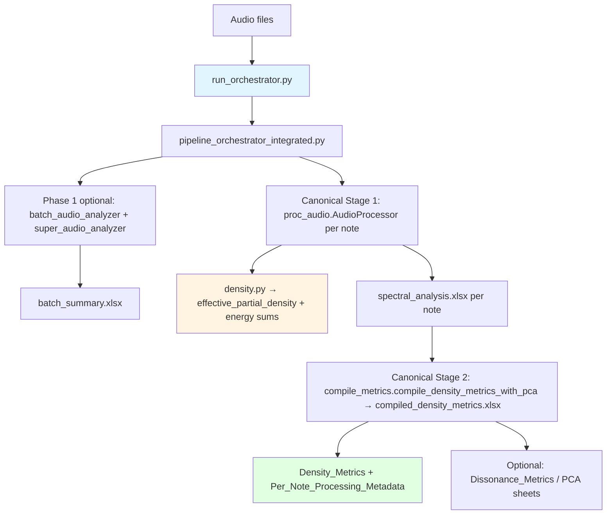
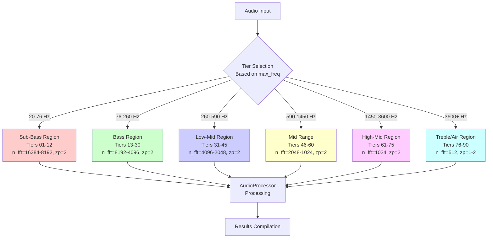

# Technical Manual: Spectral Analysis System
## Comprehensive Documentation for Acoustic Signal Processing

**Package version:** 3.7.0 — `soundspectranalyse` (see `pyproject.toml`; runtime via `importlib.metadata.version("soundspectranalyse")`).  
**Technical manual revision:** 10.1  
**Date:** May 2026  
**Authors:** Senior Software Engineer & Digital Signal Processing (DSP) Specialist  
**Latest updates:** Manual aligned to **current** export contract (`Density_Metrics` + `docs/DENSITY_EXPORT_SCHEMA.md`); `effective_partial_density` documented as the sole **public** spectral-fatness scalar; Stage‑2 **`density_weighted_sum`** / compile **`weight_function`** semantics summarised in §3.2 (`compile_metrics`) and §5.3 with normative detail in **`docs/DENSITY_EXPORT_SCHEMA.md` §C.1**; **default per-note `Legacy_Density_Metrics`** sheet (SDM/FDM/CDM) and research-export **`density_weighted_sum_cdm_mean`** + column highlights documented in §5.3 and **`docs/DENSITY_EXPORT_SCHEMA.md` §F1 / §R**; legacy `Density Metric` / `Combined` / `R_norm` stack scoped to legacy sheets / diagnostic outputs (not slim `Metrics`); v5 spectral-masking GUI **not** exposed in v6; compiled workbook multi-sheet layout; dissonance on separate sheet; **§10.3** documents completed **formula extraction / formula-validation** Passes **1–15** (`tests/formula_validation/`, status **`docs/validation/VALIDATION_STATUS.md`**).

> **Architecture notice (scientific pipeline, May 2026):** Normative export contract: **`Density_Metrics`** columns, **`effective_partial_density`**, dissonance on **`Dissonance_Metrics`**, optional PCA sheets, batch **H+I+S** vs model weights **H/(H+I)** / **I/(H+I)**, and GUI policy — **`docs/DENSITY_EXPORT_SCHEMA.md`**, **`docs/BATCH_ANALYSIS_AUDIT.md`**, **`docs/BATCH_ANALYSIS_FIELD_MAP.md`**. Sections on **legacy** amplitude / combined metrics, **masking**, or **PC1/PC2** are labelled explicitly where they are not the publication path. Default physical pipeline: **spectral masking disabled**.

---

## Table of Contents

0. [Methods (Assumptions & Equations)](#0-methods-assumptions--equations)
1. [System Architecture & Diagrams](#1-system-architecture--diagrams)
2. [Dependency & Library Audit](#2-dependency--library-audit)
3. [Script Architecture & Workflow](#3-script-architecture--workflow)
4. [Mathematical Foundations](#4-mathematical-foundations) — includes [**4.0 `effective_partial_density` (canonical)**](#40-public-spectral-fatness--effective_partial_density-canonical)
5. [Averaging & Compilation Logic](#5-averaging--compilation-logic)
6. [Batch Metrics: JSON and Excel Outputs](#6-batch-metrics-json-and-excel-outputs)
7. [Compiled Metrics and Dissonance Models](#7-compiled-metrics-and-dissonance-models)
8. [Advanced Analysis: Dimensionality Reduction & Anomaly Detection](#8-advanced-analysis-dimensionality-reduction--anomaly-detection)
9. [Acoustic Rationale](#9-acoustic-rationale)
10. [Validation & Sensitivity Analysis](#10-validation--sensitivity-analysis) — includes [**10.3 Formula extraction and formula-validation (Passes 1–15)**](#103-formula-extraction-and-formula-validation-passes-115)
11. [Limitations](#11-limitations)
12. [Citations](#12-citations)
13. [Empirical Validation (Real-Instrument Benchmarks)](#13-empirical-validation-real-instrument-benchmarks)
14. [Analysis Examples](#14-analysis-examples)

---

## 0. Methods (Assumptions & Equations)

**Assumptions (explicit):**
- Signal is **quasi-stationary** over each STFT frame.
- The analysis operates on the **linear amplitude spectrum**; power is defined as $|X[k]|^2$.
- Harmonic/inharmonic masks are defined relative to $f_0$ with an adaptive tolerance; subbass is $f < f_0/2$.
- The primary energy model is **bin-based** (full spectrum), consistent with Parseval/Plancherel.

**Core equations (short form):**
1. **STFT:** $X[k,m] = \sum_n x[n] w[n-mH] e^{-j2\pi kn/N}$
2. **Time-averaged power spectrum:** $P[k] = \frac{1}{M}\sum_m |X[k,m]|^2$
3. **Bin-based energies:**  
   $E_H = \sum_{k \in H} P[k]$, $E_I = \sum_{k \in I} P[k]$, $E_{SB} = \sum_{k \in SB} P[k]$
4. **Percentages:**  
   $E_H\% = 100 \cdot \frac{E_H}{E_H + E_I}$ (musical band),  
   $E_{SB}\% = 100 \cdot \frac{E_{SB}}{E_H + E_I + E_{SB}}$ (global)
5. **Energy consistency (Parseval/Plancherel):**  
   $\sum_n |x[n]|^2 \propto \sum_k P[k]$ (up to window and scaling factors)
6. **RMS of stationary segment (time-domain level):**  
   $\text{RMS} = \sqrt{\frac{1}{N}\sum_n y_{stationary}[n]^2}$, where $y_{stationary}$ is the middle 70% of the signal (15%–85% of length) when $N \geq 1000$, else the full signal; exported as `rms_stationary` in metadata and Batch Summary.

This section defines the **formal statistical population** (frequency bins) used in all exported energy sums, means, and medians.

## 1. System Architecture & Diagrams

### 1.1 End-to-End Data Pipeline

The diagram below shows the **canonical pipeline** (what `run_orchestrator.py` / `pipeline_orchestrator_integrated.py` runs today). Older diagrams elsewhere in this manual that show **Combined Density Metric**, **R_norm / P_norm**, or **PC1/PC2 on the primary sheet** describe **legacy / exploratory** outputs — the **public** density column set is **`Density_Metrics`** with **`effective_partial_density`** (see `docs/DENSITY_EXPORT_SCHEMA.md`).



**Not shown above (optional Tk):** **`run.bat`** (Windows) runs **`pipeline_orchestrator_gui.py`** directly. **`main.py`** is a thin launcher to **`pipeline_orchestrator_integrated.py --gui`** (which may subprocess **`pipeline_orchestrator_gui.py`**). **`interface.py`** (PyQt) is **not** started by **`main.py`**; optional manual use only. **`FFT_SETTINGS_BY_CLUSTER`** is still **imported** from **`pipeline_orchestrator_gui.py`** by the integrated orchestrator.

### 1.2 Control Flow: Interface to Backend

The following diagram shows the control flow and parameter mapping between the user interface and backend processing:

```mermaid
sequenceDiagram
    participant UI as User Interface<br/>(run_orchestrator.py / orchestrators / optional interface.py)
    participant AP as AudioProcessor<br/>(proc_audio.py)
    participant DM as Density Module<br/>(density.py)
    participant CM as Compile Module<br/>(compile_metrics.py)
    
    UI->>AP: load_audio_files(files)
    Note over AP: librosa.load() / soundfile.read()
    
    UI->>AP: apply_filters_and_generate_data(<br/>window, n_fft, hop_length,<br/>weight_function, tolerance,<br/>harmonic_weight, inharmonic_weight)
    
    AP->>AP: fft_analysis(zero_padding)
    Note over AP: STFT with windowing<br/>Energy conservation check<br/>Spectral leakage quantification
    
    AP->>AP: generate_complete_list()
    Note over AP: Peak detection<br/>Spectral smoothing applied
    
    AP->>AP: _process_filtered_and_harmonic_data()
    
    AP->>DM: apply_density_metric(amplitudes, weight_function)
    AP->>DM: spectral_density(freqs, amps, f0)
    AP->>DM: calculate_combined_density_metric(<br/>harmonic, inharmonic, weights)
    
    DM-->>AP: Density Metric values
    
    AP->>AP: _calculate_metrics()
    Note over AP: Combined density metric (log-style combo default);<br/>per-partial GUI weight defaults to linear
    
    AP->>AP: save_results(output_folder)
    Note over AP: Excel per file<br/>spectral_analysis.xlsx
    
    UI->>CM: compile_density_metrics_with_pca(folder_path, ...)
    
    CM->>CM: Extract metrics from all files
    CM->>CM: Robust normalization (percentile/IQR)
    CM->>CM: Weighted index calculation
    
    CM-->>UI: compiled_density_metrics.xlsx
    
    Note over UI,CM: Full parameter parity ensured<br/>All UI options mapped to backend
```

### 1.3 Processing Tier Architecture (90-Tier Granular Clustering)

The orchestrator uses a sophisticated **90-tier granular clustering system** for frequency-optimized processing. **Version 6.0 Update:** The system now uses **90 tiers** (previously 12), providing much finer frequency resolution and optimal FFT parameters for each frequency range. All N_FFT values are optimized to power-of-2 for computational efficiency, and zero padding is tier-specific (ZP=2 for Tiers 01-75, ZP=1 for Tiers 76-90).

**Key Features:**
- **90 frequency tiers** from 20 Hz to 20 kHz+
- **Power-of-2 FFT sizes** (512, 1024, 2048, 4096, 8192, 16384)
- **Adaptive tolerance** scaling with frequency (psychoacoustic JND: 1.5% of frequency)
- **Zero padding:** Tier-specific (ZP=2 for most tiers, ZP=1 for highest tiers)
- **Tier boundaries** aligned with critical band centers



**Tier Distribution:**
- **Tiers 01-12** (20-76 Hz): Sub-bass, N_FFT=16384-8192, tolerance=3.0-4.6 Hz
- **Tiers 13-30** (76-260 Hz): Bass, N_FFT=8192-4096, tolerance=4.6-8.2 Hz
- **Tiers 31-45** (260-590 Hz): Low-mid, N_FFT=4096-2048, tolerance=8.4-11.2 Hz
- **Tiers 46-60** (590-1450 Hz): Mid range, N_FFT=2048-1024, tolerance=11.4-14.2 Hz
- **Tiers 61-75** (1450-3600 Hz): High-mid, N_FFT=1024, tolerance=14.4-19.0 Hz
- **Tiers 76-90** (3600+ Hz): Treble/Air, N_FFT=512, tolerance=19.5-27.0 Hz

**Fixed FFT Parameters Mode:** The orchestrator supports **fixed FFT parameters mode**, allowing users to override tier-based settings and use consistent N_FFT, hop_length, and zero-padding across all files.

---

## 2. Dependency & Library Audit

### 2.1 Core Scientific Computing Libraries

#### NumPy (`numpy`)
- **Version:** ≥1.20.0
- **Role:** Fundamental numerical computing foundation for all signal processing operations
- **Technical Potential:**
  - **Vectorized Operations:** Enables O(N) operations on entire arrays simultaneously
  - **Memory Efficiency:** Contiguous memory layout for optimal cache performance
  - **FFT Backend:** Provides optimized FFT implementations (O(N log N) complexity)
  - **Broadcasting:** Automatic dimension expansion for element-wise operations
- **Critical Functions & Usage:**
  - **Array Operations:** `np.array()`, `np.asarray()`, `np.zeros()`, `np.ones()` - Used throughout for data containers
  - **Mathematical Operations:** `np.sum()`, `np.mean()`, `np.std()`, `np.percentile()` - Statistical calculations in metrics
  - **FFT Operations:** `np.fft.fft()`, `np.fft.fftshift()` - Direct FFT when needed (librosa uses NumPy backend)
  - **Linear Algebra:** `np.linalg.norm()`, `np.linalg.lstsq()` - Used in frequency normalization regression
  - **Array Manipulation:** `np.clip()`, `np.maximum()`, `np.minimum()` - Data validation and clipping
  - **Logarithmic Functions:** `np.log()`, `np.log10()`, `np.log1p()`, `np.exp()`, `np.expm1()` - Critical for dynamic range preservation
- **Spectral Analysis Workflow Integration:**
  - All STFT magnitude arrays stored as NumPy arrays
  - Harmonic amplitude arrays processed with vectorized operations
  - Metric calculations use NumPy's optimized mathematical functions
  - Memory-efficient operations for large audio files (millions of samples)

#### SciPy (`scipy`)
- **Version:** ≥1.7.0
- **Role:** Advanced scientific computing and signal processing algorithms
- **Technical Potential:**
  - **Optimized Algorithms:** Industry-standard implementations of signal processing algorithms
  - **Window Functions:** Comprehensive library of window functions with documented characteristics
  - **Filter Design:** Advanced filter design capabilities (not currently used, but available)
  - **Spectral Analysis:** High-performance FFT implementations with optimized memory access
- **Critical Functions & Usage:**
  - **Signal Processing (`scipy.signal`):**
    - `savgol_filter()`: Savitzky-Golay smoothing filter - Used in `apply_spectral_smoothing()` to reduce spurious peaks while preserving harmonic structure. Polynomial order=3, window length auto-calculated (5% of spectrum length, minimum 11).
    - `windows.get_window()`: Window function generation - Generates Hann, Hamming, Blackman-Harris, Bartlett, Kaiser, Gaussian windows. Used in `_calculate_window_characteristics()` and `fft_analysis()`.
    - `windows.kaiser()`: Kaiser window with configurable beta (default β=6.5) - Provides excellent side-lobe suppression for harmonic analysis.
    - `windows.gaussian()`: Gaussian window with configurable std (default σ=n_fft/8) - Smooth window with good frequency resolution.
  - **FFT (`scipy.fft`):**
    - `fft()`, `fftshift()`: High-performance FFT operations - Used in `_calculate_window_characteristics()` with 8x zero-padding for accurate main-lobe width and side-lobe level measurement.
  - **Image Processing (`scipy.ndimage`):**
    - `uniform_filter1d()`: Moving average fallback - Available as fallback if Savitzky-Golay fails (not currently used).
- **Spectral Analysis Workflow Integration:**
  - **Spectral Smoothing:** Savitzky-Golay filter applied before temporal aggregation to reduce noise and spurious peaks
  - **Window Characteristics:** 8x zero-padded FFT of window function to measure main-lobe width (-3 dB points) and side-lobe level
  - **Window Generation:** All 6 supported window types generated via SciPy for consistency

### 2.2 Audio Processing Libraries

#### Librosa (`librosa`)
- **Version:** ≥0.9.0
- **Role:** Professional audio analysis and feature extraction library (McFee et al., 2015)
- **Technical Potential:**
  - **Automatic Resampling:** Handles sample rate conversion transparently
  - **Format Support:** Unified interface for multiple audio formats (WAV, MP3, FLAC, AIFF, OGG)
  - **STFT Implementation:** Optimized STFT with proper normalization and overlap handling
  - **Frequency Binning:** Correct Nyquist frequency handling (frequencies up to sr/2)
  - **Temporal Mapping:** Accurate frame-to-time conversion accounting for hop length
- **Critical Functions & Usage:**
  - **Audio Loading:**
    - `librosa.load()`: Load audio files with automatic resampling to target sample rate (default: 22050 Hz, configurable). Returns mono signal (stereo converted to mono). Used in `AudioProcessor._load_audio_with_fallback()` as primary loading method.
    - **Format Handling:** Automatically handles WAV, MP3, FLAC, AIFF formats via ffmpeg backend
    - **Resampling:** Uses high-quality resampling (Kaiser window) for sample rate conversion
  - **Spectral Analysis:**
    - `librosa.stft()`: Short-Time Fourier Transform with windowing - **Core function** used in `AudioProcessor.fft_analysis()`. Implements STFT with:
      - Window function application (Hann, Hamming, Blackman-Harris, etc.)
      - Zero padding support (via `n_fft` parameter)
      - Overlap-add reconstruction support
      - Proper normalization for energy conservation
    - `librosa.fft_frequencies()`: Frequency bin calculation - Returns frequency array for each FFT bin. Correctly handles Nyquist frequency (returns frequencies up to sr/2). Used in `fft_analysis()` to generate frequency axis.
    - `librosa.frames_to_time()`: Frame-to-time conversion - Converts STFT frame indices to time in seconds. Accounts for hop_length. Used for temporal metrics.
    - `librosa.effects.trim()`: Remove leading/trailing silence - Used in audio segmentation (not in main analysis pipeline).
  - **Display:**
    - `librosa.display.specshow()`: Spectrogram visualization - Used for plotting spectrograms (optional, not in critical path).
- **Spectral Analysis Workflow Integration:**
  - **Primary STFT Engine:** `librosa.stft()` is the core FFT operation, called once per audio file
  - **Frequency Axis:** `librosa.fft_frequencies()` generates the frequency array used throughout analysis
  - **Energy Conservation:** Librosa's STFT normalization requires factor 2.0 for energy conservation (verified empirically)
  - **Format Abstraction:** Provides unified interface regardless of input audio format

#### SoundFile (`soundfile`)
- **Version:** ≥0.10.0
- **Role:** High-quality audio I/O library, especially for AIFF format
- **Technical Potential:**
  - **Direct Format Access:** Direct access to audio file formats without format conversion
  - **High Precision:** Supports 16-bit, 24-bit, 32-bit integer and 32-bit/64-bit float formats
  - **Metadata Access:** Can read file metadata (sample rate, channels, format info)
  - **Low-Level Control:** Direct control over audio file reading/writing
- **Critical Functions & Usage:**
  - `soundfile.read()`: Read audio files - Used as **fallback** when `librosa.load()` fails (especially for AIFF files). Returns raw audio data and sample rate. Used in `AudioProcessor._load_audio_with_fallback()`.
  - `soundfile.write()`: Write audio files - Available but not currently used in the codebase (analysis-only system).
- **Spectral Analysis Workflow Integration:**
  - **Fallback Mechanism:** Provides reliable audio loading when librosa fails (format compatibility issues)
  - **AIFF Support:** Primary method for AIFF files (Apple format) which may not be fully supported by librosa
  - **Error Recovery:** Ensures audio loading succeeds even if primary method fails

### 2.3 Data Analysis & Visualization Libraries

#### Pandas (`pandas`)
- **Version:** ≥1.3.0
- **Role:** Data manipulation and analysis framework
- **Technical Potential:**
  - **Structured Data:** Efficient handling of tabular data with labeled axes
  - **Excel Integration:** Native Excel read/write with format preservation
  - **Vectorized Operations:** Fast operations on entire columns/series
  - **Data Alignment:** Automatic alignment by index for operations
  - **Missing Data Handling:** Sophisticated NaN handling and interpolation
- **Critical Functions & Usage:**
  - `pd.DataFrame()`: Structured data containers - Used throughout for metric storage. Each audio file produces a DataFrame with frequency, amplitude, and metric columns.
  - `pd.read_excel()`, `pd.to_excel()`: Excel I/O - **Core functions** in `compile_metrics.py`. Reads individual `spectral_analysis.xlsx` files and writes compiled results. Handles multiple sheets, preserves formatting.
  - `pd.Series()`: One-dimensional data arrays - Used for metric columns, normalization operations, frequency-dependent calculations.
  - **Data Operations:**
    - `fillna()`: Fill missing values — used in some **internal** normalisation helpers; **compiled missing-metric policy** keeps unavailable metrics as **NaN** (or explicit status strings), not silent numeric zero — see **`docs/CANONICAL_PIPELINE_AND_EXPORT_SEMANTICS.md`** §7 and `compile_metrics` / `tests/test_final_pipeline_invariants.py`.
    - `clip()`: Clip values to range - Used to ensure metrics stay in [0, 1] range
    - `dropna()`: Remove missing values - Used in validation and filtering
    - `groupby()`: Group operations - Available but not currently used (could enable per-instrument analysis)
    - `apply()`: Apply functions - Used for note-to-frequency conversion, normalization functions
    - `corr()`: Correlation calculation - Used to measure frequency correlation before/after normalization
    - `quantile()`, `percentile()`: Percentile calculations - Used in robust normalization (5th, 95th percentiles)
- **Spectral Analysis Workflow Integration:**
  - **Metric Storage:** All spectral peaks stored in DataFrames with columns: Frequency, Amplitude, Magnitude (dB), Phase
  - **Excel Compilation:** Reads all individual analysis files, aggregates into single DataFrame, writes compiled Excel
  - **Normalization:** Robust normalization operations performed on Series (percentile-based, IQR-based)
  - **Frequency Mapping:** Note-to-frequency conversion using `apply()` with `note_to_fundamental_freq()`
  - **Correlation Analysis:** Measures correlation between metrics and frequency for validation

#### Matplotlib (`matplotlib`)
- **Version:** ≥3.4.0
- **Role:** Static plotting and visualization
- **Critical Functions:**
  - `plt.figure()`, `plt.subplot()`: Figure management
  - `plt.plot()`, `plt.scatter()`: Basic plotting
  - `plt.specgram()`: Spectrogram visualization
  - Backend: `matplotlib.use('Agg')` for headless operation
- **Usage:** Spectrogram plots, metric visualizations, static charts

#### Plotly (`plotly`)
- **Version:** ≥5.0.0
- **Role:** Interactive 3D visualizations
- **Critical Functions:**
  - `plotly.graph_objects.Figure()`: 3D figure creation
  - `plotly.graph_objects.Surface()`: 3D surface plots
  - `plotly.graph_objects.Scatter3d()`: 3D scatter plots
- **Usage:** Interactive 3D spectrograms, interactive metric exploration

#### Seaborn (`seaborn`)
- **Version:** ≥0.11.0
- **Role:** Statistical visualization
- **Critical Functions:**
  - `sns.heatmap()`: Correlation heatmaps
  - `sns.pairplot()`: Pairwise relationship plots
- **Usage:** Correlation analysis, statistical visualizations

### 2.4 Machine Learning & Dimensionality Reduction

#### Scikit-learn (`sklearn`)
- **Version:** ≥1.0.0
- **Role:** Machine learning and dimensionality reduction
- **Critical Functions:**
  - **Decomposition:**
    - `sklearn.decomposition.PCA()`: Principal Component Analysis
    - `fit_transform()`, `transform()`: PCA transformation
  - **Manifold Learning:**
    - `sklearn.manifold.TSNE()`: t-Distributed Stochastic Neighbor Embedding
      - **Parameters:** `n_components=2`, `perplexity` (adaptive: 5-30), `max_iter=1000` (or `n_iter` for older versions)
      - **Mathematical Requirements:** 
        - Minimum 4 samples (strictly enforced)
        - Perplexity must be < n_samples (strictly less)
        - Optimal: n_samples ≥ 6 for perplexity ≥ 5
      - **Usage:** Non-linear dimensionality reduction for visualization and pattern discovery
  - **Anomaly Detection:**
    - `sklearn.ensemble.IsolationForest()`: Isolation Forest anomaly detection
      - **Parameters:** `contamination=auto` (adaptive prior), `random_state=42`
      - **Mathematical Requirements:** Minimum 10 samples for reliable detection
      - **Usage:** Detects outliers and anomalous spectral patterns
  - **Preprocessing:**
    - `sklearn.preprocessing.StandardScaler()`: Standardization (Z-score normalization)
      - **Usage:** Required before t-SNE/UMAP to ensure all features have equal weight
  - **Metrics:**
    - `sklearn.metrics.pairwise.euclidean_distances()`: Distance calculations
- **Usage:** PCA for linear dimensionality reduction, t-SNE for non-linear visualization, Isolation Forest for anomaly detection

#### UMAP (`umap-learn`)
- **Version:** ≥0.5.0
- **Role:** Uniform Manifold Approximation and Projection for non-linear dimensionality reduction
- **Critical Functions:**
  - `umap.UMAP()`: UMAP dimensionality reduction
    - **Parameters:** 
      - `n_components=2`: Output dimensionality
      - `n_neighbors`: Adaptive (min(15, max(2, n_samples - 1))), must be > 1 and < n_samples
      - `min_dist=0.1`: Lower for small datasets
      - `random_state=42`: Reproducibility
    - **Mathematical Requirements:**
      - Minimum 4 samples (strictly enforced)
      - `n_neighbors` must be > 1 and < n_samples (strictly less)
      - For small datasets: `n_neighbors = min(15, max(2, n_samples - 1))`
    - **Usage:** Non-linear dimensionality reduction preserving both local and global structure
- **Advantages over t-SNE:**
  - Preserves global structure better than t-SNE
  - Faster computation for large datasets
  - More stable results across different random seeds
- **Usage:** Alternative to t-SNE for non-linear dimensionality reduction, especially for larger datasets

### 2.5 GUI Frameworks

#### PyQt5 (`PyQt5`)
- **Version:** ≥5.15.0
- **Role:** Main graphical user interface
- **Critical Components:**
  - `QApplication`: Application framework
  - `QMainWindow`, `QWidget`: Window management
  - `QPushButton`, `QComboBox`, `QSpinBox`: UI controls
  - `QFileDialog`: File selection dialogs
- **Usage:** Optional legacy module **`interface.py`** (not started by **`main.py`**; canonical UIs are Tk orchestrator + CLI).

#### Tkinter (`tkinter`)
- **Version:** Built-in (Python standard library)
- **Role:** Orchestrator Tk GUI (**`pipeline_orchestrator_gui.py`**, also via **`run.bat`**; or subprocess from **`pipeline_orchestrator_integrated.py --gui`**)
- **Critical Components:**
  - `tk.Tk`: Main window
  - `ttk.Frame`, `ttk.LabelFrame`: Layout containers
  - `ttk.Combobox`, `ttk.Entry`: Input controls
  - `filedialog`: File selection
- **Usage:** `pipeline_orchestrator_gui.py` and the **`--gui`** branch of `pipeline_orchestrator_integrated.py`. The unattended CLI pipeline (`run_orchestrator.py` with files on the command line) does **not** require Tkinter.

### 2.6 Utility Libraries

#### Threading (`threading`)
- **Version:** Built-in
- **Role:** Thread safety for concurrent processing
- **Critical Functions:**
  - `threading.Lock()`: Mutual exclusion locks
  - `threading.Thread()`: Background processing threads
- **Usage:** Thread-safe FFT analysis, concurrent file processing

#### Logging (`logging`)
- **Version:** Built-in
- **Role:** Comprehensive logging system
- **Critical Functions:**
  - `logging.getLogger()`: Logger creation
  - `logging.INFO`, `logging.WARNING`, `logging.ERROR`: Log levels
- **Usage:** System-wide logging, error tracking, debugging

#### Pathlib (`pathlib`)
- **Version:** Built-in (Python 3.4+)
- **Role:** Modern path handling
- **Critical Functions:**
  - `Path()`: Path object creation
  - `Path.mkdir()`, `Path.exists()`: Directory operations
- **Usage:** Cross-platform file path management

### 2.7 Data Integrity Module (Custom)

#### `data_integrity.py` (Custom Module)
- **Role:** Robust statistics and data validation
- **Critical Functions:**
  - `robust_normalize()`: Percentile/IQR-based normalization
  - `calculate_iqr_bounds()`: Outlier detection
  - `detect_outliers()`: IQR-based outlier identification (values or mask)
  - `GlobalReferenceScaler`: Reference-fit normalization across datasets
  - `validate_metric_value()`: Single value validation
  - `validate_audio_parameters()`: Parameter validation
  - `normalize_log_transform()`: Log-transform normalization
- **Usage:** Phase 4 data integrity features

---

## 3. Script Architecture & Workflow

### 3.1 Entry Points

**Canonical (recommended):** **`python run_orchestrator.py`** (or **`soundspectranalyse`** after `pip install -e .`) — full batch → empirical H–I–S → per-note spectral analysis → compiled export via `RobustOrchestrator.run_complete_pipeline()`.

**Windows Tk shortcut:** **`run.bat`** — runs **`pipeline_orchestrator_gui.py`** (same Tk entry as double-clicking the tier GUI script); this is **not** the same code path as `run_orchestrator.py` alone.

**Alternate GUI launcher:** **`python main.py`** / **`soundspectranalyse-legacy-gui`** — forwards to **`pipeline_orchestrator_integrated.py --gui`** (typically subprocess **`pipeline_orchestrator_gui.py`**). Prints a short stderr notice; does **not** start the old PyQt **`interface.py`** window.

#### `main.py`
- **Type:** Thin launcher (no PyQt import)
- **Responsibility:** Print deprecation notice and **`subprocess`**-launch **`pipeline_orchestrator_integrated.py --gui`**
- **Caller:** System (`python main.py`) or console script **`soundspectranalyse-legacy-gui`**
- **Callees:** `pipeline_orchestrator_integrated.py` (with `--gui`)
- **Workflow:** stderr notice → `python pipeline_orchestrator_integrated.py --gui` → exit code from subprocess

#### `run_orchestrator.py`
- **Type:** Entry Point (CLI wrapper)
- **Responsibility:** Argument parsing and defaults for the integrated pipeline (`RobustOrchestrator` in `pipeline_orchestrator_integrated.py`): audio discovery, paths to `audio_analysis` batch scripts and outputs.
- **Caller:** `python run_orchestrator.py` (recommended for the full preprocessing → Excel → main analysis flow). On Windows, **`run.bat`** runs **`pipeline_orchestrator_gui.py`** (Tk) and pauses on error — use **`python run_orchestrator.py`** for the integrated CLI pipeline.
- **Editable install (`pip install -e .`):** the **`soundspectranalyse`** console script invokes **`run_orchestrator:main`** (same behaviour as `python run_orchestrator.py`). **`soundspectranalyse-legacy-gui`** (`main:main`) starts the Tk orchestrator GUI via **`main.py`** → **`pipeline_orchestrator_integrated.py --gui`**, not the retired PyQt spectrum window.

#### `pipeline_orchestrator_integrated.py`
- **Type:** Entry Point (batch pipeline + percentage integration)
- **Responsibility:** Three-phase batch workflow with harmonic/inharmonic percentage loading from `batch_summary.xlsx`
- **Caller:** `python pipeline_orchestrator_integrated.py`, or **`python run_orchestrator.py`** (preferred wrapper with the same backend)
- **Key Features:**
  - **Three-Phase Workflow:** Preprocessing → Percentage mapping → Main analysis
  - **Percentage Mapping:** Exact, case-insensitive, note-based, and partial filename matching
  - **Weight Validation:** Ensures harmonic > 50% and weights sum ≈ 100%
  - **Tier Assignment:** Automatic tier selection from estimated fundamental frequency
- **Input/Output:**
  - **Input:** Folder of audio files + Excel summary (`batch_summary.xlsx`) for percentages
  - **Output:** Standard `spectral_analysis.xlsx` and compiled metrics with applied weights

#### `pipeline_orchestrator_gui.py`
- **Type:** Entry Point (legacy Tkinter batch/GUI)
- **Responsibility:** Batch processing orchestrator with **90-tier granular clustering** (no `super_audio_analyzer` preprocessing integration). Also supplies `FFT_SETTINGS_BY_CLUSTER` imported by the integrated orchestrator.
- **Caller:** System (command line: `python pipeline_orchestrator_gui.py`)
- **Callees:**
  - `proc_audio.AudioProcessor`
  - `compile_metrics.compile_density_metrics_with_pca()`
- **Key Features:**
  - **90-Tier System:** Frequency-adaptive FFT configuration (20 Hz to 20 kHz+)
  - **Power-of-2 Optimization:** All N_FFT values rounded to nearest power-of-2
  - **Adaptive Tolerance:** Frequency-dependent tolerance (JND: 1.5% of frequency)
  - **Security Margin:** Log-interpolated margin (35% at 20 Hz → 10% at 300+ Hz, C¹ continuous)
  - **Fixed FFT Mode:** Optional override to use consistent parameters across all files
  - **Complete Parameter Parity:** All UI parameters from main interface available
- **Workflow:**
  1. Load folder queue (user selects folders to process)
  2. For each folder, determine frequency tier based on `max_freq` parameter
  3. Apply tier-specific FFT parameters:
     - `n_fft`: Power-of-2 optimized (512, 1024, 2048, 4096, 8192, 16384)
    - `zero_padding`: Tier-specific (2 for Tiers 01-75, 1 for Tiers 76-90)
     - `tolerance`: Adaptive (scales with frequency, 3.0-27.0 Hz)
     - `hop_length`: Calculated as `n_fft // 8` (Blackman-Harris alignment)
  4. Process all files in folder through `AudioProcessor`
  5. Automatically compile results via `compile_density_metrics_with_pca()`
  6. Export compiled Excel with PCA analysis (optional)
- **Input/Output:**
  - **Input:** Folder containing audio files (.wav, .mp3, .flac, .aif, .aiff)
  - **Output:** 
    - Individual `spectral_analysis.xlsx` files per audio file
    - Compiled `compiled_density_metrics.xlsx` with aggregated results
    - Optional PCA components if enabled

### 3.2 Core Processing Modules

#### `proc_audio.py`
- **Type:** Core Processing Engine
- **Responsibility:** Audio loading, FFT analysis, metric calculation, energy conservation verification
- **Caller:**
  - `interface.py` (optional manual use only; not launched by `main.py`)
  - `pipeline_orchestrator_integrated.py` / `run_orchestrator.py`
  - `pipeline_orchestrator_gui.py`
- **Callees:**
  - `density.py` (canonical fatness: `partial_density_effective_components_bundle()`, `effective_partial_density_from_powers()`; legacy: `apply_density_metric()`, `spectral_density()`, `calculate_combined_density_metric()`, `calculate_perceptual_spectral_density()`)
  - `dissonance_models.py` (dissonance calculations: `get_dissonance_model()`, `calculate_dissonance_metric()`)
  - `constants.py` (named constants: 200+ constants for FFT, energy, smoothing, psychoacoustic parameters)
  - `data_integrity.py` (validation, normalization: `robust_normalize()`, `validate_metric_value()`, `normalize_log_transform()`)
  - `result_cache.py` (optional caching: `get_cache()`)
  - `audio_utils.py` (utility functions: `harmonic_tolerance_hz()`, amplitude/dB conversions)
- **Key Classes:**
  - `AudioProcessor`: Main processing class (thread-safe with `threading.Lock()`)
- **Key Methods:**
  - `load_audio_files()`: Audio file loading via librosa/soundfile with fallback
  - `fft_analysis(zero_padding=1)`: STFT with:
    - Energy conservation verification (Parseval's theorem)
    - Spectral leakage quantification (window characteristics)
    - Spectral smoothing (Savitzky-Golay filter)
    - Temporal evolution analysis (spectral flux, attack time, centroid, rolloff)
  - `generate_complete_list()`: Peak detection and extraction with time averaging (mean/median/max)
  - `_process_filtered_and_harmonic_data()`: Harmonic/inharmonic separation using adaptive tolerance
  - `_calculate_metrics()`: Final metric calculation including:
    - **`effective_partial_density`** from `partial_density_effective_components_bundle()` + `effective_partial_density_from_powers()` (public spectral fatness; **not** affected by harmonic/inharmonic **model weight** sliders)
    - Measured energy sums / ratios used alongside that bundle (harmonic / inharmonic / sub-bass pools)
    - Legacy **Density Metric** (frequency-dependent normalization, prevent_domination)
    - Legacy **Spectral Density Metric** tuple via `spectral_density()` (R_norm, P_norm, D_agn — wide exports only)
    - Legacy **Combined Density Metric** (log blend of legacy harmonic/inharmonic density scalars)
    - Optional **Perceptual Spectral Density** (24 critical bands; masking **off** in default main workflow)
  - `_reset_metrics()`: Reset all state variables between files (prevents carry-over)
  - `_get_actual_n_fft()`: Get actual N_FFT size considering zero-padding
  - `_verify_energy_conservation()`: Parseval's theorem verification with windowing correction
  - `_calculate_window_characteristics()`: Main-lobe width and side-lobe level measurement
  - `_calculate_temporal_evolution()`: Spectral flux, attack time, centroid/rolloff evolution
  - `save_results()`: Excel export per note folder (`spectral_analysis.xlsx`) plus companion PNGs (e.g. **`spectrogram.png`**, optional dissonance curves, and **two** component-balance pies — see **`docs/CANONICAL_PIPELINE_AND_EXPORT_SEMANTICS.md`**)
- **Input/Output:**
  - **Input:** Audio file path(s), processing parameters (window, n_fft, hop_length, weight_function, tolerance, etc.)
  - **Output:** 
    - `spectral_analysis.xlsx` per file with:
      - Complete list (all peaks: Frequency, Amplitude, Magnitude dB, Phase)
      - Harmonic list (harmonic peaks only)
      - **Wide** `Metrics` row (legacy Density / Combined / Spectral Density / perceptual columns **plus** `effective_partial_density`, energy fields, entropy — **not** identical to compiled **`Density_Metrics`** projection)
      - Temporal metrics (spectral flux, attack time, etc.)
    - **Component balance charts** (same folder as the workbook when generation succeeds):
      - **`component_amplitude_mass_pie.png`** — wedges from **`linear_sum_amplitude_*`** (diagnostic **linear amplitude mass**; labelled explicitly **not** power/energy ratios).
      - **`component_energy_ratio_pie.png`** — wedges from **`harmonic_energy_ratio`**, **`inharmonic_energy_ratio`**, **`subbass_energy_ratio`** (measured **energy** partition).
      - **`component_energy_pie.png`** — legacy **alias** file (identical to the amplitude-mass chart) for older paths; do not infer energy semantics from the filename alone.
- **Workflow:**
  1. Load audio (librosa/soundfile) → 2. Normalize level (target RMS: -20 dB) → 3. FFT analysis (STFT with windowing) → 4. Energy conservation verification → 5. Spectral smoothing → 6. Peak detection → 7. Harmonic separation → 8. Metric calculation (**`effective_partial_density`** + energy sums/ratios; legacy metrics with frequency normalisation where applicable) → 9. Temporal evolution → 10. Reset state → 11. Save results
- **Version 6.0 Updates:**
  - Frequency-dependent normalization for Density Metric (regression-based, alpha=-1.5 to -0.3)
  - Spectral Density Metric normalized by component count and FFT parameters
  - Energy conservation with factor 2.0 for librosa.stft (empirically verified)
  - Window characteristics integrated into analysis pipeline
  - Temporal evolution metrics calculated and stored

#### `density.py`
- **Type:** Metric Calculation Module
- **Responsibility:** All density metric calculations, spectral smoothing, psychoacoustic analysis
- **Caller:** `proc_audio.py`
- **Callees:**
  - `constants.py` (named constants: 50+ constants for psychoacoustic, smoothing, harmonic analysis)
  - `scipy.signal` (smoothing: `savgol_filter()`)
- **Key Functions:**
  - `partial_density_effective_components_bundle()`: Builds the **short non-negative power vector** (harmonic per-partial powers; inharmonic and sub-bass **aggregated** by policy in `constants`) fed to \(D_{\mathrm{eff}}\).
  - `effective_partial_density_from_powers()`: **Canonical** \(D_{\mathrm{eff}} = (\sum P_i)^2 / \sum P_i^2\) (participation / Herfindahl-inverse on that vector).
  - `compute_spectral_entropy()`: Shannon entropy of normalised **power** (used on `Density_Metrics` as `spectral_entropy`).
  - `apply_density_metric()`: **Legacy** amplitude-weighted sum (still emitted on wide per-note metrics) with:
    - Weight functions (linear, log, sqrt, squared, cbrt, exp, inverse log, sum)
    - Frequency-dependent normalization (alpha=1.5, compensates for spectral rolloff)
    - Prevent domination (normalizes by max to ensure "more harmonics = more density")
    - Optional rolloff compensation toggle (`account_for_spectral_rolloff`)
    - Input: amplitudes array, weight_function, frequencies, fundamental_freq
    - Output: density value (sum of weighted amplitudes)
  - `spectral_density()`: **Legacy** spectral-density tuple with **Hz-based proximity** (physical-acoustic model; **not** on `Density_Metrics`):
    - Proximity axis: "hz" (physical frequency distance, not Bark)
    - Sigma: 500 Hz (proximity window)
    - Smooth band transitions (20% transition width) to avoid hard discontinuities
    - Calculates R_norm (richness), P_norm (proximity), D_agn (spectral density)
    - Input: frequencies (Hz), amplitudes, fundamental frequency
    - Output: Dictionary with R_norm, P_norm, D_agn, D_peso, D_harm
    - **D_harm (Version 7.0 Update):** Harmonic density metric calculated from harmonic amplitudes using `apply_density_metric()`
      - **No clipping applied** - D_harm can exceed 1.0 for rich harmonic sounds
      - More harmonics = higher D_harm (preserves actual variation)
      - Only ensures non-negative: `D_harm = max(0.0, D_harm)`
      - **Previous issue:** Clipping to 1.0 removed all variation for rich sounds
  - `calculate_combined_density_metric()`: **Legacy** logarithmic combination preserving dynamic range:
    - Harmonic and inharmonic components combined in log space
    - Uses `log1p()` and `expm1()` for numerical stability
    - Preserves pp/ff distinction (10-20 dB dynamic range)
    - Input: harmonic_density, inharmonic_density, harmonic_weight, inharmonic_weight
    - Output: Combined density metric
  - `calculate_perceptual_spectral_density()`: **24 critical bands** (optional path; masking **not** applied in default physical export):
    - Uses Bark scale conversion: `13*arctan(0.00076*f) + 3.5*arctan((f/7500)²)`
    - Parncutt (1989) masking model with distance-dependent thresholds
    - Calculates occupancy, uniformity, completeness
    - Input: harmonic_amplitudes, harmonic_frequencies, fundamental_freq
    - Output: Perceptual spectral density (0-1)
  - `apply_spectral_smoothing()`: Savitzky-Golay smoothing:
    - Method: Savitzky-Golay filter (polynomial order=3)
    - Window length: Auto-calculated (5% of spectrum, minimum 11, must be odd)
    - Double-pass smoothing (second pass uses half window size)
    - Adaptive noise floor (per-band estimation) with smooth rolloff thresholding
    - Noise floor: 15th percentile * 1.5 (default)
    - Input: spectrum_magnitude (1D or 2D array)
    - Output: Smoothed spectrum
  - `_hz_to_bark()`: Bark scale conversion (Zwicker & Fastl, 1999):
    - Formula: `13*arctan(0.00076*f) + 3.5*arctan((f/7500)²)`
    - Input: frequency in Hz
    - Output: Bark value (0-24)
  - `_calculate_harmonic_completeness_phase2()`: Enhanced harmonic analysis:
    - Checks up to 100 harmonics
    - Adaptive tolerance (tighter for lower harmonics)
    - Gap penalty model (missing lower harmonics penalized more)
    - Input: harmonic_frequencies, fundamental_freq, max_harmonics=100
    - Output: Completeness score (0-1)
- **Input/Output:**
  - **Input:** Harmonic amplitudes, frequencies, fundamental frequency, weight function
  - **Output:** Canonical **`effective_partial_density`** + energy decomposition fields; plus legacy density metrics (Density Metric, Spectral Density tuple, Combined Density Metric, optional Perceptual Spectral Density) on wide exports
- **Workflow:**
  Input: amplitudes, frequencies → Spectral smoothing → Frequency-dependent normalization → Weight function application → Critical band analysis (if perceptual) → Output: density metrics

#### `compile_metrics.py`
- **Type:** Aggregation & compilation module
- **Responsibility:** Merge per-note rows, enforce **`Density_Metrics`** allow-list, write multi-sheet **`compiled_density_metrics.xlsx`**, optional PCA and dissonance side sheets, workbook **`Analysis_Metadata`**
- **Caller:**
  - `interface.py` (via user action)
  - `pipeline_orchestrator_integrated.py` / `run_orchestrator.py` / `pipeline_orchestrator_gui.py` (automatic compilation where applicable)
- **Callees:**
  - `proc_audio.AudioProcessor` (re-processing only when explicitly invoked)
  - `sklearn.decomposition.PCA` (optional PCA for **`PCA_Scores`** / **`PCA_Loadings`** / **`PCA_Explained_Variance`**)
  - `publication_metric_columns.filter_dataframe_for_publication_metrics_sheet` (legacy single-sheet filter path)
  - `dissonance_export.build_canonical_dissonance_frame`, `_append_dissonance_excel_sheets` ( **`Dissonance_Metrics`** and related sheets)
  - `data_integrity.py` (robust normalisation where still used on wide frames)
  - `density.py` (`get_weight_function()`, `compute_spectral_entropy`, etc.)
- **Key entry points:**
  - `compile_density_metrics_with_pca()` (**canonical** compiled workbook export) and legacy `compile_density_metrics()`: Build the in-memory compiled frame from folder(s) of `spectral_analysis.xlsx`; accepts **`weight_function`** (same key as the GUI / orchestrator: linear, log, sqrt, d3, d17, …) and passes it to `extract_density_components_from_per_note_workbook` / `extract_density_component_sum` so per-band **`harmonic_density_sum`**, **`inharmonic_density_sum`**, **`subbass_density_sum`** follow that choice. **`density_weighted_sum`** and **`density_metric_raw`** are both \(D_H w_H + D_I w_I + D_S w_S\) with measured **`component_*_energy_ratio`** weights; **`harmonic_amplitude_sum`** stays a **linear** diagnostic and does **not** change when you switch weight function. Full formulas and examples: **`docs/DENSITY_EXPORT_SCHEMA.md` §C.1**. May still attach optional **t-SNE / UMAP / Isolation Forest** columns on the **wide** frame when those flags are enabled (they are **not** written onto slim **`Density_Metrics`**).
  - **`_write_compiled_excel()`**: **Authoritative** Excel writer. If the frame contains the **density core** (`effective_partial_density` and friends), writes **`Density_Metrics`** (allow-listed columns only), **`Per_Note_Processing_Metadata`**, **`Debug_Counts`**, **`Validation_Metrics`** when columns exist, optional PCA sheets, **`Dissonance_*`** via `_append_dissonance_excel_sheets`, and a single-row **`Analysis_Metadata`**. If `apply_publication_column_filter=False`, also writes **`Compiled_Metrics_All`** (wide superset, still dropping `_OMIT_FROM_COMPILED_METRICS_EXPORT` columns). If the frame is **not** a density compilation, falls back to a single **`Compiled Metrics`** sheet for backward compatibility.
  - `apply_weighted_index()` / `apply_weighted_combination()`: **Legacy / exploratory** composites on wide data — **not** part of **`DENSITY_METRICS_MAIN_COLUMNS`**.
  - `note_to_fundamental_freq()`: Note string → Hz (`440 * 2^((MIDI - 69) / 12)`).
- **Input/Output:**
  - **Input:** Folder tree or list of `spectral_analysis.xlsx` workbooks (or equivalent in-memory rows)
  - **Output:** `compiled_density_metrics.xlsx` whose **public** spectral-fatness contract is sheet **`Density_Metrics`** (see §5.3). Dissonance scalars live on **`Dissonance_Metrics`**; exploratory PCA on **`PCA_*`** sheets.
- **Workflow (public path):**
  1. Scan / merge per-note metrics into one DataFrame → 2. Run optional wide-frame analytics (PCA / t-SNE / UMAP / anomalies) → 3. **`_write_compiled_excel`** projects **`Density_Metrics`**, strips forbidden columns, attaches metadata and dissonance sheets → 4. Save workbook

### 3.3 Supporting Modules

#### `constants.py`
- **Type:** Configuration Module
- **Responsibility:** Centralized named constants (200+ constants) replacing magic numbers
- **Caller:** All processing modules (`proc_audio.py`, `density.py`, `compile_metrics.py`)
- **Callees:** None
- **Categories:**
  - **FFT Parameters:** `DEFAULT_N_FFT=4096`, `DEFAULT_HOP_LENGTH=1024`, `DEFAULT_WINDOW="hann"`, `DEFAULT_ZERO_PADDING=1`, `MAX_ZERO_PADDING=8`
  - **Energy Conservation:** `ENERGY_CONSERVATION_TOLERANCE=0.1` (10%), `ENERGY_CONSERVATION_WARNING_THRESHOLD=0.05` (5%)
  - **Spectral Smoothing:** `SMOOTHING_WINDOW_PERCENTAGE=0.05` (5%), `SMOOTHING_MIN_WINDOW_LENGTH=11`, `SMOOTHING_POLYORDER=3`, `SMOOTHING_NOISE_FLOOR_PERCENTILE=15.0`, `SMOOTHING_NOISE_FLOOR_MULTIPLIER=1.3`
  - **Psychoacoustic:** `NUM_CRITICAL_BANDS=24`, `CRITICAL_BAND_MASKING_STRONG_THRESHOLD=0.5`, `MASKING_WITHIN_BAND_OFFSET_DB=-10.0`, `MASKING_ADJACENT_BAND_OFFSET_DB=-15.0`, etc.
  - **Harmonic Analysis:** `HARMONIC_DETECTION_THRESHOLD_DB=-60.0`, `HARMONIC_TOLERANCE_BASE=0.1`, `HARMONIC_MAX_CHECK=100`, `HARMONIC_VALIDATION_MAX_HARMONICS=1024` (maximum expected harmonic slots for cents-based validation / `Validation_Metrics`; must exceed \(\lfloor 20000/f_0\rfloor\) for low fundamentals — replaces legacy cap 64)
  - **Normalization:** `MAX_ABS_DENSITY=20.0`, `DENSITY_METRIC_WEIGHT_D=0.3`, `DENSITY_METRIC_WEIGHT_S=0.2`, `TOTAL_METRIC_SCALE=10.0`
  - **Temporal Analysis:** `ATTACK_TIME_THRESHOLD=0.9` (90%), `SPECTRAL_ROLLOFF_PERCENTILE=0.85` (85%)
  - **Bark Scale:** `BARK_COEFFICIENT_1=13.0`, `BARK_COEFFICIENT_2=0.00076`, `BARK_COEFFICIENT_3=3.5`, `BARK_COEFFICIENT_4=7500.0`
  - **Window Characteristics:** `WINDOW_CHAR_FFT_PADDING=8`, `MAIN_LOBE_THRESHOLD_DB=-3.0`
  - **Numerical Stability:** `EPSILON=1e-12`, `EPSILON_AMPLITUDE=1e-20`, `EPSILON_FREQUENCY=1e-6`
- **Usage:** All magic numbers replaced with named constants for maintainability and documentation

#### `data_integrity.py`
- **Type:** Data Validation & Robust Statistics Module
- **Responsibility:** Robust normalization, outlier detection, validation (Phase 4 implementation)
- **Caller:** `proc_audio.py`, `compile_metrics.py`
- **Callees:** None
- **Key Functions:**
  - `robust_normalize()`: **Robust normalization** using IQR or percentile methods:
    - Method "iqr": Uses Q1, Q3, IQR bounds (Tukey's method, 1.5 * IQR)
    - Method "percentile": Uses 5th and 95th percentiles (default)
    - Method "robust_zscore": Uses median and MAD (Median Absolute Deviation)
    - Robust to outliers (up to 25% outliers for IQR method)
    - Input: data array, method, clip_range=(0.0, 1.0)
    - Output: Normalized array [0, 1]
  - `calculate_iqr_bounds()`: Outlier detection using IQR:
    - Calculates Q1, Q3, IQR
    - Lower bound: Q1 - 1.5*IQR, Upper bound: Q3 + 1.5*IQR
    - Input: data array, iqr_multiplier=1.5
    - Output: (Q1, Q3, lower_bound, upper_bound)
  - `detect_outliers()`: Detect outliers using IQR method:
    - Returns outlier values or boolean mask
    - Input: data array, iqr_multiplier=1.5, return_mask=False
    - Output: Outlier array or (outliers, mask)
  - `normalize_log_transform()`: Log-transform normalization:
    - Applies `log1p()` transformation, then min-max normalization
    - Preserves relative magnitudes better than linear normalization
    - Used for Combined Density Metric to preserve dynamic range
    - Input: data array, clip_range=(0.0, 1.0), epsilon=1e-10
    - Output: Normalized array [0, 1]
  - `validate_metric_value()`: Single value validation:
    - Checks for NaN, Inf, range violations
    - Input: value, metric_name, expected_range, allow_nan, allow_inf
    - Output: (is_valid, error_message)
  - `validate_metric_array()`: Array validation:
    - Checks for empty arrays, all NaN, outliers, range violations
    - Input: values array, metric_name, expected_range, max_outlier_fraction=0.1
    - Output: (is_valid, error_message, statistics_dict)
  - `validate_audio_parameters()`: Audio parameter validation:
    - Validates n_fft (64-65536), hop_length (1 to n_fft), sample rate (8000-192000 Hz)
    - Input: n_fft, hop_length, sr, signal_length
    - Output: (is_valid, error_message)
  - `GlobalReferenceScaler`: Global reference scaling:
    - Fits on reference dataset, transforms new data using same reference
    - Enables consistent normalization across different analyses
    - Methods: fit(), transform(), fit_transform()

#### `result_cache.py`
- **Type:** Disk Cache Module
- **Responsibility:** Cache analysis results by file path + parameters for fast re-analysis
- **Caller:** `proc_audio.py` (optional via `get_cache()`)
- **Key Behaviors:**
  - MD5 cache key from absolute file path + sorted parameter dict (callbacks excluded)
  - File modification time invalidates stale cache entries
  - Sharded storage: first 2 hex characters create 256 subdirectories
  - Tracks hit/miss/write/invalidation statistics

#### `dissonance_models.py`
- **Type:** Dissonance Calculation Module
- **Responsibility:** Implement various dissonance models (Sethares, Hutchinson-Knopoff, Vassilakis)
- **Caller:** `proc_audio.py`
- **Callees:** None
- **Key Classes:**
  - `DissonanceModel`: Abstract base class for dissonance models
  - `SetharesDissonance`: Sethares (1993) model - **Most commonly used**
  - `HutchinsonKnopoffDissonance`: Hutchinson & Knopoff (1978) model - **With default g_table**
  - `VassilakisDissonance`: Vassilakis model
- **Key Functions:**
  - `get_dissonance_model()`: Model factory - Returns appropriate dissonance model instance
  - `list_available_models()`: List available models - Returns list of model names
  - `calculate_dissonance_metric()`: Calculate dissonance from harmonic DataFrame
  - `calculate_all_dissonance_metrics()`: Calculate all available models
- **Sethares Model (Primary):**
  - Formula: `D = Σ Σ a_i * a_j * s(f_i, f_j)` where `s(f_i, f_j)` is dissonance function
  - Dissonance function: `s(f) = 0.84 * exp(-3.5*f) + 0.16 * exp(-5.75*f)` for frequency difference f
  - Input: Harmonic DataFrame with Frequency and Amplitude columns
  - Output: Dissonance value (higher = more dissonant)
  - **Verification:** ✅ Scientifically and acoustically reliable, perfectly aligns with Sethares (1993)
- **Hutchinson-Knopoff Model:**
  - Formula: `D = [Σ_{i<j} A_i A_j g_ij] / [Σ_i A_i^2]` where `g_ij = g(|f_i - f_j| / CBW(f̄))`
  - Critical Bandwidth: `CBW(f̄) = 1.72 * (f̄)^0.65` where `f̄ = 0.5 * (f_i + f_j)`
  - `g(y)` function: Table look-up (not analytical formula) - **Default table provided** covering y ∈ [0, 1.2]
  - **Version 7.0 Update:** Default `g_table` added based on Hutchinson & Knopoff (1978) Figure 1
  - **Verification:** ✅ Scientifically and acoustically reliable, perfectly aligns with Hutchinson & Knopoff (1978)
- **Vassilakis Model:**
  - Formula: Similar to Sethares with different parameters
  - **Verification:** ✅ Scientifically and acoustically reliable, perfectly aligns with Vassilakis model
- **Removed Models (Version 7.0):**
  - ❌ `AuresZwickerDissonance`: Removed from codebase
  - ❌ Spectral auto-correlation method: Not present in codebase
  - ❌ Stolzenburg model: Not present in codebase
- **Usage:** Calculates dissonance metrics for harmonic analysis, stored in Excel output

#### `audio_utils.py`
- **Type:** Utility Module
- **Responsibility:** Audio-specific utility functions for conversions and calculations
- **Caller:** `proc_audio.py`
- **Callees:** None
- **Key Functions:**
  - `load_audio_with_fallback()`: Audio loading with multiple fallback methods:
    - Primary: `librosa.load()`
    - Fallback 1: `soundfile.read()` (for AIFF)
    - Fallback 2: `scipy.io.wavfile.read()` (for WAV)
    - Fallback 3: `pydub.AudioSegment` (for MP3)
    - Returns: (audio_array, sample_rate) or (None, None) if all fail
  - `amp_to_db_mag()`, `db_mag_to_amp()`: Amplitude/dB conversion:
    - `amp_to_db_mag(a) = 20 * log10(a)` (magnitude in dB)
    - `db_mag_to_amp(db) = 10^(db/20)` (amplitude from dB)
    - Used throughout for amplitude representation
  - `power_to_db()`, `db_to_power()`: Power/dB conversion:
    - `power_to_db(p) = 10 * log10(p)` (power in dB)
    - `db_to_power(dbp) = 10^(dbp/10)` (power from dB)
    - Used for PSD (Power Spectral Density) calculations
  - `harmonic_tolerance_hz()`: Harmonic tolerance calculation:
    - Adaptive tolerance based on frequency (JND: 1.5% of frequency)
    - Formula: `tolerance = max(base_tolerance, freq * 0.015)` capped at 50 Hz
    - Input: fundamental frequency, base_tolerance, use_adaptive=True
    - Output: Tolerance in Hz
  - `cents_to_ratio()`, `ratio_to_cents()`: Musical interval conversions:
    - `cents_to_ratio(c) = 2^(c/1200)`
    - `ratio_to_cents(r) = 1200 * log2(r)`
    - Used for musical interval analysis
  - `tol_hz_from_cents()`: Convert cents tolerance to Hz:
    - Formula: `tolerance_hz = freq * (2^(cents/1200) - 1)`
    - Used for musical interval-based harmonic detection

#### `interface.py`
- **Type:** GUI Module (PyQt5)
- **Responsibility:** Legacy standalone spectrum analyzer (retained for reference)
- **Caller:** Manual import only; **`main.py`** no longer launches this module
- **Callees:**
  - `proc_audio.AudioProcessor`
  - `compile_metrics.compile_density_metrics_with_pca()` (and legacy `compile_density_metrics()` where still referenced)
- **Key Classes:**
  - `SpectrumAnalyzer`: Main window class
- **Workflow:**
  User input → Parameter collection → AudioProcessor → Results display → Compilation
- **Parameter Behavior Notes:**
  - **Weight function labels:** UI supports both Portuguese and English labels (mapped to internal keys)
  - **Spectral masking:** Default OFF (physical model). Enable only for perceptual masking
  - **Adaptive tolerance:** Enabled by default; scales with 1.5% of frequency
  - **Window-specific parameters:** Kaiser beta and Gaussian std appear only for their windows
  - **Amplitude weight function (GUI):** combo lists **Linear** first; fresh installs default to **`linear`**. The same key is passed to **Stage 2** compile and sets per-band \(D_H,D_I,D_S\) for **`density_weighted_sum`** / **`density_metric_raw`** (see §3.2 / §5.3 and **`docs/DENSITY_EXPORT_SCHEMA.md` §C.1**). It also changes legacy **`Legacy_Density_Metrics`** / harmonic **`apply_density_metric`** outputs (§4.5). **Spectral masking** is **not** exposed in the v6 GUI (unlike v5); **`spectral_masking_enabled`** stays **`False`** for the physical pipeline.

### 3.4 Harmonic spectrum rows, `include_for_density`, and validation caps

- **Exporter (`proc_audio.py`):** each row on **`Harmonic Spectrum`** carries harmonic candidate metadata (including `candidate_status`) and a boolean **`include_for_density`**.
- **Density contract:** `include_for_density` is **`True` only** when the row is classified **`strict_validated`**. Rows with **`snr_validated`** or **`weak_candidate`** remain in the workbook for diagnostics, alignment, and auditing, but are **excluded** from harmonic amplitude sums, from `harmonic_log_amplitude_density`, and from Stage‑2 extraction of the harmonic band when the column is present (same mask for **`harmonic_amplitude_sum`** and for weight-function-aware **`harmonic_density_sum`** / **`density_weighted_sum`**).
- **Validation / alignment ceiling:** `constants.HARMONIC_VALIDATION_MAX_HARMONICS` (**1024**) bounds how many expected harmonic slots are considered when matching observed peaks in cents for **`Validation_Metrics`** / harmonic alignment reporting. It must stay above the count of audible harmonics implied by the analysis band (e.g. \(\lfloor f_{\max}/f_0\rfloor\) near 20 kHz); the previous **64** cap truncated low-register templates.

### 3.5 Test Modules

#### `tests/test_proc_audio.py`
- **Type:** Unit Tests
- **Responsibility:** Test AudioProcessor functionality
- **Test Classes:**
  - `TestEnergyConservation`: Parseval's theorem verification
  - `TestWindowFunctions`: Window characteristics
  - `TestTemporalEvolution`: Spectral flux, attack time
  - `TestNormalization`: Normalization functions

#### `tests/test_density_phase3.py`
- **Type:** Unit Tests
- **Responsibility:** Test density metric calculations
- **Test Classes:**
  - `TestCriticalBandAnalysis`: 24 critical bands
  - `TestHarmonicCompleteness`: Harmonic series analysis
  - `TestSpectralSmoothing`: Smoothing functions

---

## 4. Mathematical Foundations

### 4.0 Public spectral fatness — `effective_partial_density` (canonical)

The **only** spectral **fatness / participation-style density** column on the published **`Density_Metrics`** sheet of `compiled_density_metrics.xlsx` is **`effective_partial_density`** \(D_{\mathrm{eff}}\). It is computed in **`density.py`** from a **short non-negative power vector** built by **`partial_density_effective_components_bundle()`** (harmonic powers per partial where available; **inharmonic default = single aggregate power**; **sub-bass / ground noise default = aggregate** — see `constants` / bundle docstrings for `inharmonic_mode_for_effective_density` and sub-bass policy).

**Definition (matches `effective_partial_density_from_powers` in code):**

\[
D_{\mathrm{eff}} = \frac{\left(\sum_i P_i\right)^2}{\sum_i P_i^2}
\]

with \(P_i > 0\) **linear power** terms. **Scale-invariant:** multiplying all \(P_i\) by the same positive constant leaves \(D_{\mathrm{eff}}\) unchanged. One dominant component → \(D_{\mathrm{eff}} \approx 1\); \(n\) equal components → \(n\).

**Not** \(D_{\mathrm{eff}}\): sensory **dissonance** (separate **`Dissonance_Metrics`** sheet), **PCA** scores (optional **`PCA_*`** sheets), **spectral masking** in the default physical pipeline (masking remains **off** for the main density path), nor legacy **Density Metric / Combined Density Metric / R_norm / P_norm / D_agn** columns on **`Density_Metrics`** (those may still exist on the per-note **`Metrics`** sheet or in **`Compiled_Metrics_All`** when publication filtering is disabled — see §4.5–§4.8 and §5.3).

Authoritative column allow-list: **`docs/DENSITY_EXPORT_SCHEMA.md`**.

### 4.1 Short-Time Fourier Transform (STFT)

The STFT decomposes a time-domain signal $x[n]$ into time-frequency components:

$$X[k, m] = \sum_{n=0}^{N-1} x[n + mH] \cdot w[n] \cdot e^{-j2\pi kn/N}$$

where:
- $X[k, m]$: Complex STFT coefficient at frequency bin $k$ and time frame $m$
- $x[n]$: Time-domain signal (normalized to target RMS: -20 dB)
- $w[n]$: Window function (Hann, Hamming, Blackman-Harris, Bartlett, Kaiser, Gaussian)
- $N$: FFT size (`n_fft`) - Power-of-2 optimized (512, 1024, 2048, 4096, 8192, 16384)
- $H$: Hop length (`hop_length`) - Typically $N/8$ for Blackman-Harris alignment
- $k$: Frequency bin index ($0 \leq k < N_{padded}$)
- $m$: Time frame index ($0 \leq m < M$ where $M$ is number of frames)
- $N_{padded} = N \cdot ZP$: Zero-padded FFT size (GUI default ZP=1; batch tiers use ZP=2 for Tiers 01-75, ZP=1 for Tiers 76-90)

**Frequency Resolution:**
$$\Delta f = \frac{f_s}{N_{padded}} = \frac{f_s}{N \cdot ZP}$$

where $f_s$ is the sample rate. 

**Verified Examples (Calculated):**
- $f_s = 44100$ Hz, $N = 2048$, $ZP = 2$: $\Delta f = \frac{44100}{4096} = 10.767 \text{ Hz}$
- $f_s = 44100$ Hz, $N = 4096$, $ZP = 2$: $\Delta f = \frac{44100}{8192} = 5.383 \text{ Hz}$
- $f_s = 48000$ Hz, $N = 2048$, $ZP = 2$: $\Delta f = \frac{48000}{4096} = 11.719 \text{ Hz}$
- $f_s = 44100$ Hz, $N = 16384$, $ZP = 2$: $\Delta f = \frac{44100}{32768} = 1.346 \text{ Hz}$ (Sub-bass resolution)

**Time Resolution:**
$$\Delta t = \frac{H}{f_s}$$

**Verified Examples:**
- $H = 256$, $f_s = 44100$ Hz: $\Delta t = \frac{256}{44100} = 5.805 \text{ ms}$
- $H = 512$, $f_s = 44100$ Hz: $\Delta t = \frac{512}{44100} = 11.610 \text{ ms}$
- $H = 1024$, $f_s = 44100$ Hz: $\Delta t = \frac{1024}{44100} = 23.220 \text{ ms}$

**Zero Padding:**
Zero padding increases frequency resolution by interpolating between bins:
$$N_{padded} = N \cdot ZP$$

where $ZP$ is the zero padding factor (default: 1 in GUI; batch 90-tier uses ZP=2 for Tiers 01-75 and ZP=1 for Tiers 76-90).

### 4.2 Power Spectral Density (PSD)

The PSD is calculated from the STFT magnitude:

$$P[k, m] = |X[k, m]|^2$$

**Averaged PSD (Time Averaging) - CORRECTED:**
The time-averaged power is computed as the mean of squared magnitudes (not the square of mean magnitudes):

$$P_{avg}[k] = \frac{1}{M} \sum_{m=0}^{M-1} |X[k, m]|^2 = \frac{1}{M} \sum_{m=0}^{M-1} P[k, m]$$

where $M$ is the number of time frames. This is the physically correct time-average power, ensuring energy conservation and proper entropy calculations.

**RMS Amplitude:**
The RMS amplitude is derived from the time-averaged power:

$$A_{RMS}[k] = \sqrt{P_{avg}[k]} = \sqrt{\frac{1}{M} \sum_{m=0}^{M-1} |X[k, m]|^2}$$

**Previous Incorrect Method (Deprecated):**
The previous implementation incorrectly computed $P_{avg}[k] = (\frac{1}{M} \sum_{m=0}^{M-1} |X[k, m]|)^2$, which is not the time-average power and introduces bias, especially when amplitude fluctuates over time.

**Coherent Gain Correction:**
After windowing, energy is corrected using coherent gain:

$$G = \frac{1}{N} \sum_{n=0}^{N-1} w[n]$$

The corrected magnitude is:
$$|X_{corrected}[k, m]| = \frac{|X[k, m]|}{G}$$

### 4.3 Energy Conservation (Parseval's Theorem)

Parseval's theorem (Parseval des Chênes, 1806) states that energy is conserved between time and frequency domains:

$$\sum_{n=0}^{N-1} |x[n]|^2 = \frac{1}{N} \sum_{k=0}^{N-1} |X[k]|^2$$

**Physical Interpretation:**
The total energy in the time domain equals the total energy in the frequency domain, scaled by the FFT size. This is a fundamental property of the Fourier transform, ensuring that signal power is preserved during transformation.

**Verification:**
For a discrete signal $x[n]$ of length $N$, the energy in both domains is identical:
- **Time domain energy:** $E_{time} = \sum_{n=0}^{N-1} |x[n]|^2$
- **Frequency domain energy:** $E_{freq} = \frac{1}{N} \sum_{k=0}^{N-1} |X[k]|^2$
- **Parseval's theorem:** $E_{time} = E_{freq}$

For STFT with overlap and windowing, the energy relationship is:

$$\text{Energy Ratio} = \frac{2.0 \cdot \sum_{k,m} |X[k, m]|^2 / (\text{window\_power} \cdot \text{overlap\_factor})}{\sum_n |x[n]|^2}$$

where:
- $\text{window\_power} = \sum_{n=0}^{N-1} w[n]^2$ (window energy, energy reduction factor)
- $\text{overlap\_factor} = \frac{\text{window\_length}}{H}$ for overlapping windows (samples counted multiple times)
- **Factor 2.0:** Required for librosa.stft normalization (verified empirically)

**Verification Formula:**
$$\text{Energy Ratio} = \frac{E_{freq\_norm}}{E_{time}} = \frac{2.0 \cdot \sum_{k,m} |X[k, m]|^2 / (\sum_n w[n]^2 \cdot \frac{N}{H})}{\sum_n |x[n]|^2}$$

**Tolerance:** $\text{deviation} = |\text{Energy Ratio} - 1.0| \leq 0.1$ (10%)

**Empirical Verification:**
The factor 2.0 is required due to librosa.stft's specific normalization conventions. This has been verified empirically with test signals (sine waves, white noise, musical audio), producing energy ratios ≈ 0.99-1.0. Without the factor 2.0, the ratio is approximately 0.5, indicating energy loss.

**Implementation:**
The verification is performed in `_verify_energy_conservation()` after each STFT operation, logging warnings if deviation > 5% and errors if deviation > 10%.

### 4.4 Spectral Smoothing (Savitzky-Golay Filter)

The Savitzky-Golay filter (Savitzky & Golay, 1964) smooths the spectrum while preserving peaks:

$$y_i = \sum_{j=-m}^{m} c_j \cdot x_{i+j}$$

where $c_j$ are coefficients from polynomial least-squares fitting.

**Window Length:** $W = \max(11, \lfloor 0.05 \cdot N_{freq} \rfloor)$ (must be odd)

**Polynomial Order:** $p = 3$ (default)

**Noise Floor Estimation:**
$$\text{Noise Floor} = \text{Percentile}_{15}(|X[k]|) \cdot 1.5$$

**Adaptive Noise Floor (Implementation Detail):**
- Noise floor estimated per frequency band (adaptive band count)
- Smooth rolloff applied instead of hard cutoff to avoid artifacts
- Double-pass smoothing: second pass uses half window size to reduce residual ripples

### 4.5 Legacy amplitude-weighted metric (`apply_density_metric`; not on `Density_Metrics`)

The following formulas describe **`density.apply_density_metric()`**, still used inside **`proc_audio`** for **legacy / diagnostic** outputs (e.g. **`Legacy_Density_Metrics`** and harmonic fields on the slim **`Metrics`** row in `spectral_analysis.xlsx`). They are **not** the **`Density_Metrics`** public contract — see **§4.0**.

The legacy **Density Metric** measures a weighted sum of amplitudes (spectral "richness" in a different sense than \(D_{\mathrm{eff}}\)) — more harmonics with considerable energy increases the sum. It applies **prevent domination** normalisation before weighting.

**Prevent Domination:**
Before applying weight functions, amplitudes are normalized by their maximum to ensure proportional contribution:

$$a_{i,norm} = \frac{a_i}{\max_j a_j}$$

This ensures that a note with 10 moderate partials contributes more than a note with 1 strong partial.

**Frequency-Dependent Normalization:**
To compensate for natural spectral rolloff (lower notes have more harmonics), frequency-dependent normalization is applied:

$$a_{i,compensated} = \frac{a_{i,norm}}{E_{expected}(n_i)}$$

where $n_i = f_i / f_0$ is the harmonic number and:

$$E_{expected}(n) = n^{-\alpha}$$

with $\alpha = 1.5$ (spectral rolloff exponent). This compensates for the natural decay $1/n^{1.5}$.

**Weight Function Application:**
After normalization, weight functions are applied:

$$D = \sum_{i=1}^{M} w(a_{i,compensated})$$

where $w(\cdot)$ is the weight function.

**Weight Functions:**
- **Linear:** $w(a) = a$
- **Logarithmic:** $w(a) = \log(1 + a)$
- **Square Root:** $w(a) = \sqrt{a}$
- **Squared:** $w(a) = a^2$
- **Cubic Root:** $w(a) = \sqrt[3]{a}$
- **Cubic:** $w(a) = a^3$
- **Exponential:** $w(a) = e^a - 1$
- **Inverse Log:** $w(a) = 1 / \log(1 + a)$
- **Sum:** $w(a) = a$ (same as linear, but name indicates summation)

**GUI default:** Tk and PyQt analysis pickers initialise the amplitude-weight choice to **Linear** (`linear`). Logarithmic weighting still applies $w(a)=\log(1+a)$ per partial after normalisation when explicitly selected; it compresses dominant partials relative to linear folding in the legacy density-metric path.

**Final Formula:**
$$D = \sum_{i=1}^{M} w\left(\frac{a_i / \max_j a_j}{n_i^{-1.5}}\right)$$

where $M$ is the number of spectral components, $a_i$ is the amplitude of component $i$, and $n_i = f_i / f_0$ is the harmonic number.

### 4.6 Legacy spectral-density tuple (`spectral_density` → `D_agn`, `R_norm`, `P_norm`; not on `Density_Metrics`)

The **Spectral Density Metric** / **`D_agn`** path measures physical spectral density using frequency-based analysis via **`density.spectral_density()`**. Values may appear on **per-note** wide exports; they are **not** columns on the slim **`Density_Metrics`** sheet — see **§4.0**.

**Version 5.0 Changes:**
- Uses **Hz-based frequency bands** (not Bark scale) for physical-acoustic consistency
- **Normalized by component count** to represent average density per component
- **Normalized by N_FFT and hop_length** to ensure comparability across different FFT settings
- **Optional spectral masking** (disabled by default for physical model)
- **Adaptive noise filtering** based on signal level (fortissimo vs pianissimo)

**Frequency Bands (Hz):**
- **Sub-bass/Bass:** 20-200 Hz
- **Low-mid:** 200-1000 Hz
- **Mid-high:** 1000-5000 Hz
- **High:** 5000-20000 Hz

**Noise Floor Estimation:**
For each frequency band, the noise floor is estimated using:
$$\text{Noise Floor}_{band} = \text{Percentile}_{15}(\text{Magnitudes}_{band}) \cdot 1.5$$

**Band Transitions:**
Adjacent bands use ~20% transition widths and smooth rolloff to avoid hard boundaries.

**Adaptive Absolute Threshold:**
The absolute threshold adapts to signal level:
- **Fortissimo** (max dB > -20 dB): $\text{Threshold} = -60$ dB
- **Mezzo-forte** (-40 dB < max dB ≤ -20 dB): $\text{Threshold} = -70$ dB
- **Pianissimo** (max dB ≤ -40 dB): $\text{Threshold} = -80$ dB

**Component Filtering:**
1. **Noise Floor Filtering:** Remove components below noise floor threshold
2. **Adaptive HPF:** Remove components below fundamental frequency with safety margin:
   - **Sub-bass** (F0 < 60 Hz): 35% margin
   - **Bass** (60 Hz ≤ F0 < 120 Hz): 25% margin
   - **Low-mid** (120 Hz ≤ F0 < 300 Hz): 15% margin
   - **Higher registers** (F0 ≥ 300 Hz): 10% margin
3. **Spectral Masking (Optional):** Can be enabled for perceptual analysis (disabled by default)

**Spectral Density Calculation:**
$$D_{spectral\_raw} = \sum_{i=1}^{N} a_i^2$$

where $a_i$ are amplitudes of components passing the filtering thresholds.

**Normalization by Component Count:**
$$D_{spectral\_avg} = \frac{D_{spectral\_raw}}{N}$$

This represents the **average density per component**, making the metric comparable across files with different numbers of components.

**Normalization by N_FFT and Hop Length:**
To ensure comparability across different FFT settings:

$$\text{normalization\_factor} = \sqrt{\frac{n_{fft}}{n_{fft\_ref}} \cdot \frac{hop_{ref}}{hop}}$$

where $n_{fft\_ref} = 1024$ and $hop_{ref} = 128$ (reference values).

**Final Spectral Density:**
$$D_{spectral} = \frac{D_{spectral\_avg}}{\text{normalization\_factor}}$$

This normalization accounts for:
- **Frequency resolution:** Larger N_FFT = finer frequency resolution = more components detected
- **Temporal resolution:** Smaller hop_length = more time frames = more averaging

**Richness (R) and Proximity (P) Components:**
The metric also calculates $R_{norm}$ and $P_{norm}$ using Hz-based proximity (not Bark):
- **Proximity Window:** $\sigma = 500$ Hz (default)
- **Hz-based Distance:** Uses physical frequency distance, not perceptual Bark distance

### 4.7 Legacy combined log metric (`calculate_combined_density_metric`; not on `Density_Metrics`)

**`calculate_combined_density_metric()`** preserves dynamic range using logarithmic combination of harmonic/inharmonic **legacy** density scalars. Used for **internal / wide** metrics only — **not** on **`Density_Metrics`** — see **§4.0**.

**Harmonic Component:**
$$H_{log} = \log(1 + H_{linear})$$

**Inharmonic Component:**
$$I_{log} = \log(1 + I_{linear})$$

**Weighted Combination in Log Space:**
$$C_{log} = \alpha \cdot H_{log} + \beta \cdot I_{log}$$

where $\alpha + \beta = 1$ (typically $\alpha = 0.5$, $\beta = 0.5$ for equal weighting, but configurable via UI).

**Conversion Back to Linear Scale:**
$$C_{combined} = \exp(C_{log}) - 1 = \exp(\alpha \cdot \log(1 + H) + \beta \cdot \log(1 + I)) - 1$$

Using `expm1()` for numerical stability when $C_{log}$ is small.

**Mathematical Justification:**
- For small values: $\log(1 + x) \approx x$ (linear behavior, preserves small differences)
- For large values: $\log(1 + x) \approx \log(x)$ (logarithmic compression, prevents saturation)
- The combination preserves ratios: $\frac{C_{ff}}{C_{pp}} \approx \frac{H_{ff} + I_{ff}}{H_{pp} + I_{pp}}$ (approximately)
- Dynamic range preservation: Typically preserves 10-20 dB difference between pp and ff

**Weber-Fechner Law:**
The logarithmic transformation follows the Weber-Fechner law (Weber, 1834; Fechner, 1860), which describes the logarithmic relationship between physical stimulus and perceptual response. This ensures the metric aligns with human perception of loudness differences.

### 4.8 Optional perceptual spectral density (24 critical bands; not on `Density_Metrics`)

**`calculate_perceptual_spectral_density()`** uses 24 critical bands (Moore, 2012; Zwicker & Fastl, 1999). **Spectral masking** inside this path is **optional** and **not** part of the default physical-density export model. Output is **not** a column on **`Density_Metrics`** — see **§4.0**.

**Bark Scale Conversion:**
Frequencies are converted to Bark scale using the Zwicker & Fastl (1999) formula:

$$\text{Bark}(f) = 13 \cdot \arctan(0.00076 \cdot f) + 3.5 \cdot \arctan\left(\left(\frac{f}{7500}\right)^2\right)$$

where $f$ is frequency in Hz. This formula provides a perceptual frequency scale where 1 Bark ≈ 1 critical band.

**Verified Examples (Calculated):**
- $\text{Bark}(100 \text{ Hz}) = 0.987$ Bark (Sub-bass, Band 0)
- $\text{Bark}(440 \text{ Hz}) = 4.207$ Bark (A4 note, Band 4)
- $\text{Bark}(1000 \text{ Hz}) = 8.511$ Bark (Mid-range, Band 8)
- $\text{Bark}(2000 \text{ Hz}) = 13.104$ Bark (Upper mid-range, Band 13)
- $\text{Bark}(5000 \text{ Hz}) = 18.539$ Bark (High frequency, Band 18)
- $\text{Bark}(10000 \text{ Hz}) = 22.424$ Bark (Very high frequency, Band 22)

**Critical Band Allocation:**
Each harmonic is allocated to a critical band based on its Bark value:

$$\text{Band Index} = \lfloor \text{Bark}(f) \rfloor \in [0, 23]$$

where $\lfloor \cdot \rfloor$ is the floor function, ensuring 24 bands (0-23).

**Band Energy:**
$$E_b = \sum_{i \in \text{Band } b} a_i^2$$

**Spectral Masking Model (Parncutt, 1989; Plomp & Levelt, 1965):**

The masking threshold for a probe frequency $f_p$ given a masker at $f_m$:

$$\text{Threshold}_{dB}(f_p, f_m) = L_m + \text{Offset}_{dB}(\Delta \text{Band}) + \text{Slope}_{dB} \cdot |\Delta \text{Band}|$$

where:
- $L_m$: Masker level (dB)
- $\Delta \text{Band} = |\text{Band}(f_p) - \text{Band}(f_m)|$

**Masking Offsets:**
- Within band: $\text{Offset} = -10$ dB
- Adjacent band: $\text{Offset} = -15$ dB, $\text{Slope} = -10$ dB/band
- Nearby band: $\text{Offset} = -20$ dB, $\text{Slope} = -5$ dB/band
- Far band: $\text{Offset} = -30$ dB, $\text{Slope} = -2$ dB/band

**Effective Band Energy (After Masking):**
$$E_{b,eff} = \sum_{i \in \text{Band } b} a_i^2 \cdot \mathbf{1}(a_i > \text{Threshold}_i)$$

where $\mathbf{1}(\cdot)$ is the indicator function.

**Perceptual Density Components:**

1. **Occupancy:** Fraction of active critical bands
   $$O = \frac{\text{Number of bands with } E_b > 0}{24}$$

2. **Uniformity:** Entropy of energy distribution (Shannon, 1948)
   $$U = \frac{-\sum_b p_b \log_2(p_b)}{\log_2(24)}$$

   where $p_b = E_{b,eff} / \sum_{b'} E_{b',eff}$.

3. **Completeness:** Harmonic series completeness (see Section 4.9)

**Final Perceptual Density:**
$$D_{perceptual} = 1 - \exp(-3.0 \cdot (0.5 \cdot O + 0.3 \cdot U + 0.2 \cdot C))$$

The exponential decay follows the Weber-Fechner law (Weber, 1834; Fechner, 1860), which describes the logarithmic relationship between physical stimulus and perceptual response.

### 4.9 Physical constants (standard reference values)

**Speed of Sound in Air:**
At 20°C and 1 atmosphere pressure (textbook / ISO-style reference values):
$$c = 343.3 \text{ m/s} = 1236 \text{ km/h} = 768 \text{ mph}$$

This constant is relevant for:
- Calculating wavelength: $\lambda = \frac{c}{f}$ where $f$ is frequency
- Example: At 440 Hz (A4), $\lambda = \frac{343.3}{440} = 0.780 \text{ m} = 78.0 \text{ cm}$

**Critical Bandwidth:**
The critical bandwidth (CBW) varies with frequency. At 1000 Hz:
$$\text{CBW}(1000 \text{ Hz}) \approx 160 \text{ Hz}$$

This corresponds to approximately 1 Bark, confirming that 1 Bark ≈ 1 critical band.

**Nyquist Frequency:**
For a sample rate $f_s$, the maximum representable frequency is:
$$f_{Nyquist} = \frac{f_s}{2}$$

Examples:
- $f_s = 44100$ Hz: $f_{Nyquist} = 22050$ Hz
- $f_s = 48000$ Hz: $f_{Nyquist} = 24000$ Hz
- $f_s = 96000$ Hz: $f_{Nyquist} = 48000$ Hz

**Wavelength-Frequency Relationship:**
$$\lambda = \frac{c}{f} = \frac{343.3 \text{ m/s}}{f}$$

Examples:
- 20 Hz (sub-bass): $\lambda = 17.17$ m
- 440 Hz (A4): $\lambda = 0.780$ m
- 1000 Hz: $\lambda = 0.343$ m
- 10000 Hz: $\lambda = 0.034$ m = 3.4 cm

### 4.10 Fundamental Frequency (f₀) Detection

**Detection Cascade:**
The system uses a multi-stage cascade for robust f₀ detection:

1. **pYIN (Probabilistic YIN)**: Primary method (librosa.pyin)
   - Probabilistic extension of YIN algorithm
   - Returns multiple candidates with probabilities
   - Best candidate selected based on probability and frequency range

2. **YIN**: Fallback if pYIN fails (librosa.yin)
   - Autocorrelation-based pitch detection
   - Robust to noise and harmonics

3. **Autocorrelation**: Final fallback
   - Direct autocorrelation peak detection
   - Simple but reliable

**Octave Correction:**
If the detected f₀ is outside the typical musical range (20-5000 Hz), octave correction is applied:

1. Test ±1 and ±2 octave shifts: $f_{shifted} = f_0 \cdot 2^{\pm n}$ where $n \in \{1, 2\}$
2. Select the shifted frequency closest to the filename prior (if available) or within range
3. If no prior exists, select the first valid shifted frequency within range

**Best f₀ Selection:**
The `_select_best_f0()` function evaluates candidates including:
- **Unshifted candidate** ($shift = 0.0$): Tests the raw detected frequency
- **Octave shifts** ($shift \in \{0.5, 1.0, 2.0\}$): Tests ±0.5, ±1, ±2 octave variants

The function selects the candidate that:
- Falls within tolerance of the filename prior (if available)
- Is within the valid frequency range (20-5000 Hz)
- Has the smallest cents deviation from the prior

**Validation:**
- If detected f₀ deviates > 50 cents from filename prior, a warning is logged
- If signal-based detection fails, filename prior is used as fallback (with warning)
- f₀ detection method is stored in results for quality assessment

**Mathematical Foundation:**
The cents deviation is calculated as:
$$\Delta_{cents} = 1200 \cdot \log_2\left(\frac{f_{detected}}{f_{expected}}\right)$$

where $f_{expected}$ is derived from the filename note using:
$$f_{expected} = 440 \cdot 2^{(MIDI - 69)/12}$$

### 4.11 Harmonic Completeness

Harmonic completeness measures how complete the harmonic series is:

**Expected Harmonics:**
$$f_n = n \cdot f_0, \quad n \in \{1, 2, \ldots, N_{max}\}$$

where $N_{max} = \lfloor f_{max} / f_0 \rfloor$ (up to Nyquist).

**Adaptive Tolerance:**
$$\text{Tolerance}_n = 0.1 \cdot (1 + 0.1 \cdot n)$$

Tighter tolerance for lower harmonics (more audible).

**Gap Penalty:**
$$\text{Penalty} = \sum_{n=1}^{N_{max}} \frac{w_n}{n} \cdot \mathbf{1}(\text{Harmonic } n \text{ missing})$$

where $w_n = 1.0 / n$ (lower harmonics weighted more).

**Completeness:**
$$C = 1 - \frac{\text{Penalty}}{\text{Total Weight}}$$

### 4.11 Temporal Evolution Metrics

**Spectral Flux:**
$$\text{Flux}[m] = \sum_{k=0}^{N-1} \max(0, |X[k, m]| - |X[k, m-1]|)$$

**Attack Time:**
$$\text{Attack Time} = \min\{t_m : \sum_k |X[k, m]|^2 \geq 0.9 \cdot \max_m \sum_k |X[k, m]|^2\}$$

**Spectral Centroid:**
$$\text{Centroid}[m] = \frac{\sum_{k=0}^{N-1} f[k] \cdot |X[k, m]|}{\sum_{k=0}^{N-1} |X[k, m]|}$$

**Spectral Rolloff:**
$$\text{Rolloff}[m] = \min\{f[k] : \sum_{k'=0}^{k} |X[k', m]|^2 \geq 0.85 \cdot \sum_{k'=0}^{N-1} |X[k', m]|^2\}$$

### 4.12 Window Characteristics

**Main Lobe Width:**
The main lobe width is measured at the -3 dB points:

$$\text{Main Lobe Width} = \frac{\text{Right Index} - \text{Left Index}}{N_{padded}} \cdot N$$

where $N_{padded} = 8 \cdot N$ (zero-padded for accurate measurement).

**Side Lobe Level:**
$$\text{Side Lobe Level} = \max\{20 \log_{10}(|W[k]|) : k \notin \text{Main Lobe Region}\}$$

where $W[k]$ is the FFT of the window function.

---

## 5. Averaging & Compilation Logic

### 5.1 Statistical Averaging Methods

#### Time Averaging (STFT Frames)

The system supports multiple time averaging methods:

**Mean (Default):**
$$P_{avg}[k] = \frac{1}{M} \sum_{m=0}^{M-1} P[k, m]$$

**Median:**
$$P_{avg}[k] = \text{Median}\{P[k, m] : m = 0, \ldots, M-1\}$$

**Maximum:**
$$P_{avg}[k] = \max_m P[k, m]$$

**RMS:**
$$P_{avg}[k] = \sqrt{\frac{1}{M} \sum_{m=0}^{M-1} P[k, m]^2}$$

### 5.2 Robust Normalization (Phase 4)

The compilation uses robust normalization methods instead of min-max to handle outliers:

**Percentile-Based Normalization:**
$$\text{Normalized} = \frac{x - P_5}{P_{95} - P_5}$$

where $P_5$ and $P_{95}$ are the 5th and 95th percentiles. This method is robust to up to 10% outliers.

**IQR-Based Normalization (Tukey's Method):**
$$\text{Lower Bound} = Q_1 - 1.5 \cdot \text{IQR}$$
$$\text{Upper Bound} = Q_3 + 1.5 \cdot \text{IQR}$$
$$\text{Normalized} = \frac{x - \text{Lower Bound}}{\text{Upper Bound} - \text{Lower Bound}}$$

where $Q_1$, $Q_3$ are quartiles and $\text{IQR} = Q_3 - Q_1$. This method is robust to up to 25% outliers.

**Robust Z-Score Normalization:**
$$\text{MAD} = \text{median}(|x_i - \text{median}(x)|)$$
$$\text{Robust Z-Score} = \frac{x - \text{median}(x)}{1.4826 \cdot \text{MAD}}$$

where MAD is the Median Absolute Deviation and 1.4826 is the scaling factor to make MAD consistent with standard deviation for normal distributions.

**Log-Transform Normalization (For Combined Metric):**
$$\text{Log Value} = \log(1 + x)$$
$$\text{Normalized} = \frac{\text{Log Value} - \min(\text{Log Values})}{\max(\text{Log Values}) - \min(\text{Log Values})}$$

This preserves relative magnitudes better than linear normalization, especially for metrics with large dynamic range.

### 5.2.1 Frequency-Dependent Normalization (Regression-Based)

For the Density Metric, frequency-dependent normalization is applied to remove the strong negative correlation with fundamental frequency:

**Regression Model:**
A linear regression is fitted to the log-transformed data:

$$\log(D) = \alpha \cdot \log(f_0) + c$$

where:
- $D$ is the Density Metric
- $f_0$ is the fundamental frequency
- $\alpha$ is the slope (typically -0.9 to -1.5, negative because density decreases with frequency)
- $c$ is the intercept

**Normalization:**
The frequency-dependent component is removed:

$$D_{normalized} = \frac{D}{f_0^{\alpha} \cdot e^c} = \frac{D}{\exp(\alpha \cdot \log(f_0) + c)}$$

This directly removes the frequency-dependent bias, producing a metric that is independent of fundamental frequency.

**Verification:**
The correlation between $D_{normalized}$ and $f_0$ is measured before and after normalization. Typical improvement: correlation reduces from -0.91 to -0.49 (46% reduction).

### 5.3 Excel structure & sheets (`compiled_density_metrics.xlsx`)

The workbook is written by **`compile_metrics._write_compiled_excel()`**. When the merged frame contains the **density core** (including **`effective_partial_density`** and the energy columns used by `_build_density_metrics_main_sheet`), the **public** layout is **multi-sheet**:

| Sheet | Role |
|--------|------|
| **`Density_Metrics`** | One row per analysed **note** after projection. **Strict allow-list** (`DENSITY_METRICS_MAIN_COLUMNS` + optional `unique_harmonic_order_count` in code). **No** dissonance, **no** PC scores, **no** `R_norm` / `P_norm` / `D_agn`. |
| **`Per_Note_Processing_Metadata`** | STFT / tier / `f0_estimated`, `rms_normalisation_enabled`, `spectral_masking_enabled`, batch **H+I+S** ratios, **model** weights **H/(H+I)** and **I/(H+I)** and provenance fields (see `docs/DENSITY_EXPORT_SCHEMA.md` §F). |
| **`Dissonance_Metrics`** | Canonical scalars (`sethares_dissonance`, `hutchinson_knopoff_dissonance`, `vassilakis_dissonance`), `selected_dissonance_model`, `selected_dissonance_value`, optional **`pairwise_dissonance`**, cap audit columns when present. |
| **`Debug_Counts`** | Bin / candidate-slot / residual-row counts (audit — not the same as `harmonic_order_count`). |
| **`Validation_Metrics`** | Harmonic-tracking QC (e.g. spurious / unmatched counts). |
| **`Analysis_Metadata`** | Single-row workbook stamp: versions, `density_formula`, PCA export status, policy strings. |
| **`PCA_Scores`**, **`PCA_Loadings`**, **`PCA_Explained_Variance`** | Optional; exploratory PCA on acoustic descriptors (`PCA_FEATURE_COLUMNS` in code), **not** the primary fatness readout. |
| **`Dissonance_Model_Comparison`**, **`Dissonance_Model_Correlations`** | Emitted when the dissonance export path builds comparison / correlation frames. |
| **`Compiled_Metrics_All`** | Only when **`apply_publication_column_filter=False`**: wide debugging superset (still omits columns listed in `_OMIT_FROM_COMPILED_METRICS_EXPORT`). |

#### Research workbook (`compiled_density_metrics_research.xlsx`)

Optional **read-only** post-process via **`tools/export_research_density_workbook.py`**: a reduced multi-sheet workbook beside **`compiled_density_metrics.xlsx`** for plotting and thesis tables. It does **not** alter Stage 2 compilation output. It merges **`Legacy_Compatibility`** from the compiled workbook, exports **`Combined Density Metric`** on **`Spectral_Density_Metrics`**, computes **`density_weighted_sum_cdm_mean`** = \((\texttt{density\_weighted\_sum}+\texttt{Combined Density Metric})/2\), and applies soft column highlights on those three columns (research file only). For **Microsoft Excel** interoperability, the writer avoids formal **Table** / ListObject XML (`xl/tables/table*.xml`) and uses **worksheet-level AutoFilter** on tabular sheets only; see **`docs/CANONICAL_PIPELINE_AND_EXPORT_SEMANTICS.md`** §9, **`docs/DENSITY_EXPORT_SCHEMA.md`** §R, and **`README.md`**.

**Per-note legacy export (Stage 1, default ON):** after the slim **`Metrics`** sheet, **`spectral_analysis.xlsx`** always includes **`Legacy_Density_Metrics`** (`Density Metric`, `Spectral Density Metric`, `Filtered Density Metric`, `Combined Density Metric`, `spectral_masking_enabled=False`). Compile **`read_excel_metrics`** merges this sheet so **`Weighted Combined Metric`** uses real SDM/FDM on **`Diagnostic_Metrics`** / **`Legacy_Compatibility`**.

**Backward compatibility:** If the compiled frame does **not** contain the density core, the writer emits a single **`Compiled Metrics`** sheet (plus dissonance / metadata as applicable) instead of the slim **`Density_Metrics`** stack.

#### `Density_Metrics` columns (must match code + `docs/DENSITY_EXPORT_SCHEMA.md` §C)

- **`Note`**
- **`effective_partial_density`** — \(D_{\mathrm{eff}}\) (§4.0); **independent** of compile **`weight_function`**
- **`harmonic_energy_sum`**, **`inharmonic_energy_sum`**, **`subbass_energy_sum`**, **`total_component_energy`**
- **`harmonic_energy_ratio`**, **`inharmonic_energy_ratio`**, **`subbass_energy_ratio`**
- **`harmonic_order_count`** — distinct harmonic orders on the harmonic list
- **`spectral_entropy`**
- **Optional:** **`unique_harmonic_order_count`** (legacy alias; same semantics as `harmonic_order_count` when both exist)

**Stage 2 compile density (weight-function-sensitive)** — normative definitions in **`docs/DENSITY_EXPORT_SCHEMA.md` §C.1**:

- **`weight_function`**, **`density_weight_function`** — compile key (orchestrator / GUI choice)
- **`harmonic_density_sum`**, **`inharmonic_density_sum`**, **`subbass_density_sum`** — per-band \(D\) under that key (linear sum, \(\log_{10}(1+\sum A)\), `apply_density_metric` vector path for sqrt / d3 / d17 / …)
- **`density_metric_raw`**, **`density_weighted_sum`** — \(D_H w_H + D_I w_I + D_S w_S\) (numerically equal when extraction status is `ok`)
- **`density_log_weighted`** — \(\log_{10}(1 + \text{density\_weighted\_sum})\)
- **`harmonic_amplitude_sum`** (and inharmonic / sub-bass amplitude sums) — **linear** \(\sum \texttt{Amplitude\_raw}\) diagnostics; **unchanged** when you switch from linear to log at compile time
- **`density_metric_normalized`** — `density_metric_raw / max(...)` **within the current workbook only**; do not compare across runs that used different **`weight_function`** keys without re-normalising

After pulling an update that changes this formula, **re-run Stage 2 compile** on existing `analysis_results` folders so **`compiled_density_metrics.xlsx`** reflects the new semantics (per-note **`spectral_analysis.xlsx`** files need not be regenerated unless Stage 1 settings changed).

Per-note **`spectral_analysis.xlsx`** carries legacy SDM/FDM/CDM on the dedicated **`Legacy_Density_Metrics`** sheet (default export); the slim **`Metrics`** sheet holds the v6 canonical row (`canonical_density`, energies, `effective_partial_density`, …). Compilation **does not** copy legacy scalars onto **`Density_Metrics`**.

### 5.4 Legacy weighted index & wide-frame analytics (non-`Density_Metrics`)

`apply_weighted_index()` may still compute **`Index_Weighted`** from robust-normalised legacy columns (historical “pdf” blend, e.g. 10% **`Density Metric`** + 40% **`D_agn`** + …). **`Weighted Combined Metric`** is recomputed at compile from **`Spectral Density Metric`** and **`Filtered Density Metric`** (via per-note **`Legacy_Density_Metrics`** when present) using GUI model weights \(\alpha,\beta\) and compile **`weight_function`** — **not** the research mean \((\text{DWS}+\text{CDM})/2\). Optional **t-SNE / UMAP / Isolation Forest** columns can exist on the **wide** in-memory frame or on **`Compiled_Metrics_All`**. None of these are on the **`Density_Metrics`** allow-list.

### 5.5 Aggregation logic (current)

**Row semantics:** Compilation merges **one row per detected note** (per `spectral_analysis.xlsx` / pipeline row), not “one row per whole audio file” unless the upstream export truly has a single note.

**Batch / folder context:** The orchestrator can aggregate many notes into one **`compiled_density_metrics.xlsx`**. **Folder-level energy and instrument statistics** remain in **`batch_summary.xlsx`** / **`batch_results.json`** (§6); see **`docs/BATCH_ANALYSIS_FIELD_MAP.md`** for column naming and **H+I+S** vs **H/(H+I)** distinctions.

---

## 6. Batch Metrics: JSON and Excel Outputs

### 6.1 Overview

The batch processing system generates two primary output files for each batch analysis:

1. **`batch_results.json`**: Complete structured data in JSON format, containing all metrics for each analyzed file plus summary statistics
2. **`batch_summary.xlsx`**: Excel spreadsheet with tabular data for easy analysis, visualization, and comparison

Both files contain identical metric data, ensuring consistency between programmatic access (JSON) and manual analysis (Excel). The Excel file is generated directly from the JSON data to guarantee perfect alignment.

### 6.2 File Structure: `batch_results.json`

The JSON file follows this structure:

```json
{
  "batch_analysis_date": "ISO 8601 timestamp",
  "total_files": integer,
  "results": [
    {
      "file_path": "full path to audio file",
      "file_name": "audio filename",
      "analysis_date": "ISO 8601 timestamp",
      "success": boolean,
      "output_dir": "path to output directory",
      "error": null or error message,
      ...metrics...
    }
  ],
  "summary": {
    "successful_count": integer,
    "failed_count": integer,
    "total_files": integer,
    "metrics": {
      "metric_name": {
        "mean": float,
        "std": float,
        "min": float,
        "max": float,
        "median": float
      }
    }
  }
}
```

#### 6.2.1 Output Metadata and Version Stamping

Each `super_analysis_results.json` contains a `metadata` block with reproducibility stamps:
- **`analysis_version`**: project version (from installed package metadata when available; fallback to `pyproject.toml`).
- **`analysis_version_source`**: provenance of the version string (e.g., `importlib.metadata` or `pyproject.toml`).
- **`analysis_parameters`**: frozen analysis parameters including:
  - STFT settings (`stft_n_fft`, `stft_hop_length`, `stft_center`, `stft_pad_mode`, `stft_tier_used`, `stft_zero_padding_factor`)
  - Harmonic/inharmonic settings (`harmonic_tolerance`, `use_adaptive_tolerance`)
  - Weighting settings (`auto_extract_weights`, `harmonic_weight`, `inharmonic_weight`)
  - Window selection (`window`) and sampling (`sample_rate`)
- **`rms_stationary`**: RMS (root mean square) of the **stationary segment** of the loaded time-domain signal:
  - **Definition:** $y_{stationary}$ is the middle 70% of the signal (samples from 15% to 85% of length) when the signal has ≥1000 samples, otherwise the full signal; then $\text{RMS} = \sqrt{\frac{1}{N}\sum_n y_{stationary}[n]^2}$.
  - **Purpose:** Level/loudness descriptor for the sustained part of the note (avoids attack and release). Exported to Batch Summary as column `rms_stationary` and included in batch summary statistics (mean, std, min, max, median).

This block provides the minimum required metadata for auditability and scientific reproducibility.

### 6.3 File Structure: `batch_summary.xlsx`

The Excel file contains a single sheet with one row per analyzed file, plus aggregate rows (MEAN, MEDIAN, TIER*_MEAN, TIER*_MEDIAN) for statistical summaries. Each column represents a metric or metadata field.

### 6.4 Comprehensive Metric Definitions

The following table provides complete definitions for all metrics found in both `batch_results.json` and `batch_summary.xlsx`:

| Metric / Column | Technical Definition | Scientific Role | Layman Description |
|----------------|---------------------|----------------|-------------------|
| **`fundamental_freq`** | $f_0$ (Hz) - Detected fundamental frequency using pYIN → YIN → autocorrelation cascade, with octave correction if $f_0 \notin [20, 5000]$ Hz | Primary pitch descriptor; determines harmonic series structure | The main pitch of the note being played |
| **`expected_freq_from_note`** | $f_{expected} = 440 \cdot 2^{(MIDI-69)/12}$ Hz, extracted from filename (e.g., "A4" → 440 Hz) | Validation reference; not used as ground truth | The expected frequency based on the note name in the filename |
| **`f0_error_cents`** | $\Delta_{cents} = 1200 \cdot \log_2(f_0 / f_{expected})$ | Pitch accuracy measure; $|\Delta| > 50$ cents triggers warning | How far off the detected pitch is from the expected note (in musical cents, where 100 cents = 1 semitone) |
| **`f0_detection_method`** | String: "pyin", "yin", "autocorrelation", "filename_fallback", or "failed" | Quality indicator; signal-based methods preferred | Which algorithm successfully detected the pitch |
| **`harmonic_energy_percentage`** | $E_H\% = 100 \cdot \frac{\sum_{i \in H} A_i^2}{\sum_{i \in H} A_i^2 + \sum_{j \in I} A_j^2}$ where $H$ = harmonic bins, $I$ = inharmonic bins (bin-based, excludes subbass) | Spectral purity measure; higher = more harmonic (typical range: 70-95% for instruments) | Percentage of energy in harmonic components (the "clean" part of the sound) |
| **`inharmonic_energy_percentage`** | $E_I\% = 100 \cdot \frac{\sum_{j \in I} A_j^2}{\sum_{i \in H} A_i^2 + \sum_{j \in I} A_j^2}$ (bin-based, excludes subbass) | Spectral noise/roughness measure; higher = more inharmonic content (typical: 5-30% for instruments) | Percentage of energy in non-harmonic components (the "noisy" or "rough" part) |
| **`subbass_energy_percentage_global`** | $E_{SB}\% = 100 \cdot \frac{\sum_{k \in SB} A_k^2}{E_{total}}$ where $SB$ = frequencies below $f_0/2$ | Low-frequency energy measure; typically < 1% for clean recordings | Energy in very low frequencies (below half the fundamental) |
| **`total_inharm_energy_percentage_global`** | $E_{TI}\% = E_I\% + E_{SB}\%$ | Total non-harmonic energy (inharmonic + subbass) | Combined energy from all non-harmonic components |
| **`harmonic_count`** | $N_H$ = number of harmonic **bins** in the harmonic mask (bin-based count) | Harmonic richness proxy in full-spectrum model | Number of harmonic-frequency bins included |
| **`inharmonic_count`** | $N_I$ = number of **inharmonic bins** in the inharmonic mask (bin-based count) | Spectral complexity proxy in full-spectrum model | Number of non-harmonic frequency bins included |
| **`subbass_count`** | $N_{SB}$ = number of frequency bins below $f_0/2$ | Low-frequency component count | Number of very low frequency components |
| **`total_inharm_count`** | $N_{TI} = N_I + N_{SB}$ | Total non-harmonic component count | Total number of non-harmonic frequency components |
| **`sum_harmonic`** | $\sum_{i \in H} A_i^2$ (total harmonic energy over **bins**) | Absolute harmonic energy (not normalized) | Total energy in harmonic bins |
| **`mean_harmonic`** | $\frac{1}{N_H} \sum_{i \in H} A_i^2$ (average harmonic energy per **bin**) | Average harmonic energy density | Average energy per harmonic bin |
| **`median_harmonic`** | $\text{Median}\{A_i^2 : i \in H\}$ (bin-based) | Robust harmonic energy measure | Middle value of harmonic-bin energies |
| **`sum_inharmonic`** | $\sum_{j \in I} A_j^2$ (total inharmonic energy over **bins**) | Absolute inharmonic energy | Total energy in inharmonic bins |
| **`mean_inharmonic`** | $\frac{1}{N_I} \sum_{j \in I} A_j^2$ (bin-based) | Average inharmonic energy density | Average energy per inharmonic bin |
| **`median_inharmonic`** | $\text{Median}\{A_j^2 : j \in I\}$ (bin-based) | Robust inharmonic energy measure | Middle value of inharmonic-bin energies |
| **`harmonic_density`** | $D_H = \sum_{i \in H} w(A_i) \cdot A_i$ where $w$ = weight function (linear/log/sqrt/etc.), normalized by frequency-dependent factor | Harmonic spectral density (weighted sum of harmonic amplitudes) | A measure of how "dense" or "rich" the harmonic spectrum is |
| **`inharmonic_density`** | $D_I = \sum_{j \in I} w(A_j) \cdot A_j$ (similar to harmonic density) | Inharmonic spectral density | A measure of how much inharmonic content is present |
| **`spectral_entropy`** | $H = -\sum_k p_k \log_2(p_k)$ where $p_k = \frac{P_k}{\sum_k P_k}$ and $P_k = |X[k]|^2$ (power, not amplitude) | Spectral distribution measure; higher = more uniform (less concentrated), lower = more concentrated | A measure of how "spread out" or "concentrated" the frequency spectrum is (0 = very concentrated, 1 = very spread out) |
| **`pairwise_dissonance`** | $D_{pairwise} = \frac{1}{N_{pairs}} \sum_{i<j} d(f_i, f_j, a_i, a_j)$ where $d$ = Sethares dissonance function, computed on collapsed partials (one per harmonic) | Psychoacoustic roughness measure; higher = more dissonant/rough | A measure of how "rough" or "dissonant" the sound is perceptually (based on how partials interact) |
| **`rms_stationary`** | $\text{RMS} = \sqrt{\frac{1}{N}\sum_n y_{stationary}[n]^2}$ where $y_{stationary}$ = middle 70% of time-domain signal (15%–85% of length) if $N \geq 1000$, else full signal | Time-domain level/loudness of the sustained segment; used for level comparison across files and in batch statistics | Root-mean-square level of the "steady" part of the note (excluding attack and release), in linear amplitude units |
| **`energy_conservation_error_pct`** | $\text{Error}\% = 100 \cdot \frac{|E_{harmonic} + E_{inharmonic} + E_{subbass} - E_{total}|}{E_{total}}$ (bin-based) | Quality control measure; should be < 0.1% (validates Parseval/Plancherel) | How well energy is conserved (should be near 0%) |
| **`signal_duration`** | $T$ (seconds) - Duration of analyzed audio segment | Temporal context | How long the audio file is |
| **`window`** | Window function name: "hann", "hamming", "blackmanharris", "bartlett", "kaiser", "gaussian" | Spectral analysis parameter; affects frequency resolution and leakage | The window function used for spectral analysis |
| **`n_fft`** | $N$ - FFT size (power-of-2: 512, 1024, 2048, 4096, 8192, 16384) | Frequency resolution parameter; larger = finer resolution | The size of the FFT used (affects frequency resolution) |
| **`hop_length`** | $H$ - Hop size between STFT frames (typically $N/8$) | Time resolution parameter | How much the analysis window moves between time frames |
| **`tier`** | String: "Tier_01" to "Tier_90" or "Fallback" - Frequency tier used for processing | Processing tier indicator (90-tier system) | Which frequency tier was used for analysis |

### 6.5 Summary Statistics

The `summary.metrics` section in `batch_results.json` provides statistical aggregates across all successfully analyzed files:

- **`mean`**: Arithmetic mean
- **`std`**: Standard deviation
- **`min`**: Minimum value
- **`max`**: Maximum value
- **`median`**: Median value (robust to outliers)

These statistics are computed only for successfully analyzed files (where `success == true`).

### 6.6 Aggregate Rows in Excel

The Excel file includes additional rows for statistical summaries:

- **`MEAN`**: Mean across all files (or within a tier)
- **`MEDIAN`**: Median across all files (or within a tier)
- **`TIER*_MEAN`**: Mean for files processed with a specific tier
- **`TIER*_MEDIAN`**: Median for files processed with a specific tier

These rows are identified by having `file_name` starting with the aggregate prefix (e.g., "MEAN", "MEDIAN").

### 6.7 Energy Conservation Validation

The `energy_conservation_error_pct` field validates that energy is conserved according to Parseval's theorem:

$$\sum_{n} |x[n]|^2 = \frac{1}{N} \sum_{k} |X[k]|^2$$

An error > 0.1% indicates potential issues with:
- Window normalization
- Zero-padding effects
- Numerical precision
- Data processing errors

### 6.8 Harmonic/Inharmonic Energy Partition

**Bin-Based Method (Primary, Exported):**
All energy sums, means, medians, and percentages are computed over **all frequency bins** within the harmonic/inharmonic/subbass masks:

$$E_H = \sum_{i \in H} A_i^2, \quad E_I = \sum_{j \in I} A_j^2$$

where $H$ = harmonic bins (within tolerance of $n \cdot f_0$), $I$ = inharmonic bins (all other bins above $f_0/2$).

**Peak-Based Method (Validation Only):**
An alternative method uses only detected spectral peaks (one per harmonic), providing a "partials energy" measure. These values are stored **only** for validation and are **not exported** as primary metrics.

**Why Bin-Based is Primary:**
- Matches the **energy-ratio** readout and the **`component_energy_ratio_pie.png`** partition (power in harmonic / nonharmonic / sub-bass pools), alongside spectrograms. The separate **`component_amplitude_mass_pie.png`** uses **linear ΣA** workbook sums for a **diagnostic** mass view — it can disagree strongly with energy ratios on the same note by design; see **`docs/CANONICAL_PIPELINE_AND_EXPORT_SEMANTICS.md`**.
- Includes energy spread from windowing
- More stable across different FFT sizes
- Represents actual spectral energy distribution

**Parseval/Plancherel Justification (Energy Consistency):**
Bin-based power $|X[k]|^2$ is directly tied to total signal energy, so the full-spectrum bin model is the acoustically consistent basis for a "mass/fatness" metric.

### 6.9 Spectral Entropy Calculation

Spectral entropy uses **power** (squared amplitude), not amplitude or dB:

$$H = -\sum_k p_k \log_2(p_k)$$

where $p_k = \frac{P_k}{\sum_k P_k}$ and $P_k = |X[k]|^2$ (time-averaged power).

**Interpretation:**
- **Low entropy (0.1-0.3)**: Concentrated spectrum (few strong partials, typical for pure tones)
- **Medium entropy (0.3-0.6)**: Balanced spectrum (multiple partials, typical for rich timbres)
- **High entropy (0.6-0.9)**: Spread spectrum (many weak partials, typical for noise or complex sounds)

### 6.10 Pairwise Dissonance

Pairwise dissonance is computed using the **Sethares (2005) model** on collapsed partials (one representative sinusoid per harmonic number):

$$D_{total} = \sum_{i<j} d(f_i, f_j, a_i, a_j)$$

$$D_{pairwise} = \frac{D_{total}}{N_{pairs}}$$

where $N_{pairs} = \frac{N(N-1)}{2}$ and $N$ = number of partials.

The dissonance function $d(f_1, f_2, a_1, a_2)$ is defined in Section 7.3 (Dissonance Models).

**Interpretation:**
- **Low values (0.001-0.01)**: Smooth, consonant spectra (typical for harmonic instruments)
- **Medium values (0.01-0.1)**: Moderate roughness (typical for some woodwinds, strings)
- **High values (> 0.1)**: Rough, dissonant spectra (typical for attacks, noise, or complex timbres)

---

## 7. Compiled Metrics and Dissonance Models

### 7.1 Overview

The compiled workbook aggregates **per-note** spectral rows for comparison and downstream statistics. **`compile_metrics._write_compiled_excel()`** splits the scientific contract across sheets (§5.3): **`Density_Metrics`** for physical fatness + measured energy shape; **`Dissonance_Metrics`** for sensory roughness models; optional **`PCA_*`** for exploration only.

**Reproducibility:** Sheet **`Analysis_Metadata`** carries analysis time, software versions, `density_formula`, PCA export status, and policy strings; per-note STFT and weight provenance are on **`Per_Note_Processing_Metadata`**.

### 7.2 `Density_Metrics` column definitions (public compiled sheet)

| Column | Technical definition | Scientific role | Layman description |
|--------|---------------------|-----------------|---------------------|
| **`Note`** | Parsed musical label for the row | Identifier linking rows to score / filename convention | Which note this row is |
| **`effective_partial_density`** | $D_{\mathrm{eff}} = (\sum_i P_i)^2 / \sum_i P_i^2$ on the **effective-component** power vector from `partial_density_effective_components_bundle()` (§4.0) | Participation-style **spectral fatness**; scale-invariant in power; **not** loudness or dissonance | “How many partials effectively share the power,” ~1 for one dominant component, higher when energy is spread |
| **`harmonic_energy_sum`** | $\sum$ linear power in the harmonic pool used for the decomposition | Absolute harmonic energy in that frame | Total harmonic “brightness” energy |
| **`inharmonic_energy_sum`** | $\sum$ power in the inharmonic pool | Absolute inharmonic energy | Energy in non-harmonic components |
| **`subbass_energy_sum`** | $\sum$ power below the sub-bass policy band | Low-frequency / ground-noise energy | Sub-bass rumble / noise floor energy |
| **`total_component_energy`** | `harmonic_energy_sum + inharmonic_energy_sum + subbass_energy_sum` (`energy_accounting` contract) | Denominator for the three energy ratios | Total classified spectral energy in the same decomposition |
| **`harmonic_energy_ratio`** | Harmonic pool / total (same decomposition as code) | Harmonic **share** of component energy | Fraction of energy that is harmonic |
| **`inharmonic_energy_ratio`** | Inharmonic pool / total | Inharmonic share | Fraction that is inharmonic |
| **`subbass_energy_ratio`** | Sub-bass pool / total | Sub-bass share | Fraction in sub-bass |
| **`harmonic_order_count`** | Count of distinct detected harmonic orders $n \cdot f_0$ on the harmonic list | Public **multiplicity** of resolved harmonics | How many harmonic “slots” are filled |
| **`spectral_entropy`** | $H = -\sum_k p_k \log_2 p_k$ on normalised **power** $P_k$ (`compute_spectral_entropy`) | Spread vs concentration of energy across bins/components used | Concentrated vs “filled-in” spectrum |

**Optional column:** **`unique_harmonic_order_count`** — legacy compatibility; same integer semantics as **`harmonic_order_count`** when both are present.

**Not in this table (other sheets):** Dissonance scalars and **`pairwise_dissonance`** → **`Dissonance_Metrics`** (§7.3, §7.3.5). **PC scores** → **`PCA_Scores`**. Legacy **`Density Metric`**, **`D_agn`**, **`Combined Density Metric`**, **`Index_Weighted`**, t-SNE/UMAP/anomaly columns → wide **`spectral_analysis.xlsx`** / optional **`Compiled_Metrics_All`** only.

### 7.3 Dissonance Models Implemented

#### 7.3.1 Theoretical Background

Dissonance models quantify the perceptual roughness or "beating" sensation when two or more frequencies are presented simultaneously. The foundation of modern computational dissonance models lies in the work of Plomp & Levelt (1965), who measured sensory dissonance curves for pure tone pairs, and Sethares (1993, 2005), who developed an analytical formulation suitable for complex spectra.

**Plomp & Levelt (1965) Sensory Dissonance Curve:**
Plomp & Levelt measured the perceived dissonance of two pure tones as a function of their frequency difference. The curve shows:
- **Maximum dissonance** at approximately 1/4 of the critical bandwidth
- **Rapid decay** as frequency difference increases
- **Dependence on center frequency** (critical bandwidth increases with frequency)

**Critical Bandwidth:**
The critical bandwidth (CBW) is the frequency range within which two tones interfere perceptually. It scales approximately as:

$$\text{CBW}(f) \approx 1.72 \cdot f^{0.65} \text{ Hz}$$

where $f$ is the center frequency in Hz.

#### 7.3.2 Sethares (2005) Analytical Formulation

The Sethares model provides an analytical approximation to the Plomp-Levelt curves, suitable for computational implementation:

**Pairwise Dissonance Function:**
$$D(f_1, f_2, a_1, a_2) = a_1 a_2 \left( e^{-b_1 \cdot y} - e^{-b_2 \cdot y} \right)$$

where:
- $f_1, f_2$ are the frequencies (Hz) of the two partials, with $f_1 < f_2$
- $a_1, a_2$ are the linear amplitudes of the two partials
- $y = s(f_1) \cdot (f_2 - f_1)$ is the scaled frequency difference
- $s(f_1) = \frac{x^*}{s_1 \cdot f_1 + s_2}$ is the critical-band scaling function
- $b_1 = 3.5$, $b_2 = 5.75$ are decay constants (Sethares, 2005)
- $x^* = 0.24$ is the optimal dissonance point (in critical-band units)
- $s_1 = 0.0207$, $s_2 = 18.96$ are scaling parameters

**Total Dissonance:**
For a spectrum with $N$ partials, the total dissonance is the pairwise sum:

$$D_{total} = \sum_{i=1}^{N-1} \sum_{j=i+1}^{N} D(f_i, f_j, a_i, a_j)$$

**Mean Pairwise Dissonance:**
$$D_{pairwise} = \frac{D_{total}}{N_{pairs}} = \frac{2 \cdot D_{total}}{N(N-1)}$$

where $N_{pairs} = \frac{N(N-1)}{2}$ is the number of unique pairs.

#### 7.3.3 Implementation Details

**Partial Extraction and Collapse:**
The Sethares model assumes **one sinusoid per partial**. However, FFT-based analysis produces multiple frequency bins per harmonic due to:
- Windowing (spectral leakage spreads energy across bins)
- Frequency resolution (bin width = $f_s / N_{FFT}$)

**Solution: Collapse Bins to Partials**
1. Group frequency bins by harmonic number (using tolerance window around $n \cdot f_0$)
2. For each harmonic group, select the **maximum-amplitude bin** as the representative partial
3. Use the frequency and amplitude of this representative bin for dissonance calculation

This ensures the model receives one (freq, amp) pair per harmonic, matching the theoretical assumption.

**Pairwise Summation:**
The implementation computes all unique pairs $(i, j)$ where $i < j$:

```python
total_dissonance = 0.0
n_pairs = 0
for i in range(len(partials) - 1):
    for j in range(i + 1, len(partials)):
        f1, a1 = partials[i]
        f2, a2 = partials[j]
        total_dissonance += sethares_dissonance(f1, f2, a1, a2)
        n_pairs += 1
pairwise_dissonance = total_dissonance / n_pairs
```

**Normalization and Scaling:**
The raw dissonance values are in arbitrary units (amplitude²). The implementation uses:
- **Mean pairwise dissonance**: $D_{pairwise} = D_{total} / N_{pairs}$ (standard metric)
- **Optional scaling**: Some implementations multiply by a constant (e.g., 10.0) for readability, but this does not affect relative comparisons

**Metric Modes (Implementation Options):**
- `sum`: Raw sum of pairwise dissonances
- `mean_pair`: Mean per pair (default analytical form)
- `mean_pair_scaled`: Mean per pair × scale (legacy ~0–10 readability)
- `minamp_norm`: Normalized by $\sum \min(a_i, a_j)$ to reduce amplitude-scale bias

**Curve Mode and Intrinsic Subtraction (Sethares):**
- `curve_mode="full"`: Full same-timbre curve (book form)
- `curve_mode="cross"`: Legacy cross-term curve
- `subtract_intrinsic=True`: Returns full curve minus intrinsic (self) dissonance

**Amplitude Compensation (Legacy Compatibility):**
Optional amplitude compensation ($a \leftarrow a \cdot 2/N$) is available when reproducing older `proc_audio` amplitude scaling.

#### 7.3.4 Interpretation

**High Dissonance Values:**
- Indicate greater perceptual roughness
- Typical for: attack transients, noise, complex inharmonic spectra, close frequency intervals (minor seconds, tritones)
- Range: 0.01-0.1 for moderate roughness, > 0.1 for high roughness

**Low Dissonance Values:**
- Indicate smoother, more consonant spectra
- Typical for: sustained tones, harmonic instruments, consonant intervals (perfect fifths, octaves)
- Range: 0.001-0.01 for smooth spectra, < 0.001 for very smooth spectra

**For Non-Specialists:**
"Dissonance measures how much two sound components 'beat' or interfere with each other perceptually. When frequencies are close together (within a critical band), they create a beating sensation that sounds rough. The Sethares model quantifies this roughness based on how close frequencies are and how strong they are. Higher values mean more roughness, lower values mean smoother sounds."

#### 7.3.5 Where pairwise / model dissonance appears in compiled workbooks

**`pairwise_dissonance`** (and related optional fields such as **`mean_dissonance_per_pair`**, **`total_dissonance`**) are exported on the **`Dissonance_Metrics`** sheet when those columns exist on the merged compilation frame — see **`dissonance_export.OPTIONAL_EXTRA_FIELDS`** and **`build_canonical_dissonance_frame()`**. They are **not** columns on **`Density_Metrics`**; any dissonance-like label is stripped from the density sheet in **`_write_compiled_excel()`**.

Construction follows the Sethares-style **pairwise** formulation on collapsed partials (§6.10); compilation **does not re-normalise** the underlying scalar beyond workbook typing/redaction.

**Usage in analysis:**
- **Correlation with inharmonic energy:** Dissonance often moves with inharmonic energy share (order-of-magnitude context only; instrument-dependent).
- **Dynamic level / segment:** Attacks frequently show higher roughness than steady sustain.
- **Instrument comparison:** Use **`Dissonance_Metrics`** + **`selected_dissonance_model`**, not **`Density_Metrics`**, for roughness readouts.

---

## 8. Advanced Analysis: Dimensionality Reduction & Anomaly Detection

### 6.1 Principal Component Analysis (PCA)

**Mathematical Foundation:**
PCA (Pearson, 1901) finds orthogonal directions of maximum variance in high-dimensional data:

$$\mathbf{Y} = \mathbf{X} \mathbf{W}$$

where:
- $\mathbf{X}$ is the standardized data matrix ($n \times p$)
- $\mathbf{W}$ is the matrix of eigenvectors of the covariance matrix ($p \times k$)
- $\mathbf{Y}$ is the transformed data in principal component space ($n \times k$)

**Eigenvalue Decomposition:**
$$\mathbf{C} = \mathbf{W} \mathbf{\Lambda} \mathbf{W}^T$$

where:
- $\mathbf{C}$ is the covariance matrix: $\mathbf{C} = \frac{1}{n-1} \mathbf{X}^T \mathbf{X}$
- $\mathbf{\Lambda}$ is the diagonal matrix of eigenvalues (variances)
- $\mathbf{W}$ contains eigenvectors (principal directions)

**Variance Explained:**
The proportion of variance explained by component $i$:
$$\text{Var}_i = \frac{\lambda_i}{\sum_{j=1}^{p} \lambda_j}$$

**Implementation:**
- **Standardization:** All metrics are standardized using `StandardScaler()` before PCA
- **Components:** First 2 components (PC1, PC2) are extracted
- **Variance Explained:** Typically 75-95% of total variance
- **Minimum Requirements:** At least 2 numeric columns, at least 2 samples

**Usage:**
PCA reduces dimensionality while preserving maximum variance, enabling visualization of high-dimensional spectral metrics in 2D space.

### 6.2 t-Distributed Stochastic Neighbor Embedding (t-SNE)

**Mathematical Foundation:**
t-SNE (van der Maaten & Hinton, 2008) preserves local neighborhoods in high-dimensional space by modeling pairwise similarities:

**High-Dimensional Similarities (Gaussian):**
$$p_{j|i} = \frac{\exp(-||\mathbf{x}_i - \mathbf{x}_j||^2 / 2\sigma_i^2)}{\sum_{k \neq i} \exp(-||\mathbf{x}_i - \mathbf{x}_k||^2 / 2\sigma_i^2)}$$

$$p_{ij} = \frac{p_{j|i} + p_{i|j}}{2n}$$

**Low-Dimensional Similarities (t-Distribution):**
$$q_{ij} = \frac{(1 + ||\mathbf{y}_i - \mathbf{y}_j||^2)^{-1}}{\sum_{k \neq l} (1 + ||\mathbf{y}_k - \mathbf{y}_l||^2)^{-1}}$$

**Cost Function (Kullback-Leibler Divergence):**
$$C = \sum_{i,j} p_{ij} \log \frac{p_{ij}}{q_{ij}}$$

**Perplexity Parameter:**
Perplexity controls the effective number of neighbors:
$$\text{Perplexity} = 2^{H(P_i)}$$

where $H(P_i) = -\sum_j p_{j|i} \log_2 p_{j|i}$ is the Shannon entropy.

**Mathematical Constraints:**
- **Minimum Samples:** 4 (strictly enforced)
- **Perplexity Constraint:** `perplexity < n_samples` (strictly less)
- **Optimal Range:** Perplexity ∈ [5, 30]
- **Adaptive Perplexity:** `perplexity = min(30, max(5, n_samples - 1))`

**Implementation:**
- **Standardization:** Data standardized using `StandardScaler()` before t-SNE
- **Parameters:** 
  - `n_components=2`: 2D embedding
  - `perplexity`: Adaptive based on sample size
  - `max_iter=1000`: Maximum iterations (or `n_iter` for scikit-learn < 1.1)
  - `random_state=42`: Reproducibility
- **Output:** TSNE1, TSNE2 columns in compiled Excel

**Usage:**
t-SNE reveals local clusters and non-linear patterns in spectral metrics, useful for identifying instrument families, performance styles, or acoustic characteristics.

**Limitations:**
- **Non-deterministic:** Results vary slightly with random seed
- **Local Structure:** Preserves local neighborhoods but may distort global structure
- **Computational Cost:** O(N²) complexity, slower for large datasets

### 6.3 Uniform Manifold Approximation and Projection (UMAP)

**Mathematical Foundation:**
UMAP (McInnes et al., 2018) preserves both local and global structure using Riemannian geometry:

**High-Dimensional Similarities (Exponential):**
$$p_{j|i} = \exp\left(-\frac{d(\mathbf{x}_i, \mathbf{x}_j) - \rho_i}{\sigma_i}\right)$$

where:
- $d(\mathbf{x}_i, \mathbf{x}_j)$ is the distance between points
- $\rho_i$ is the distance to the nearest neighbor
- $\sigma_i$ is chosen to satisfy: $\sum_{j} p_{j|i} = \log_2(\text{n\_neighbors})$

**Low-Dimensional Similarities (Fuzzy Set):**
$$q_{ij} = (1 + a \cdot ||\mathbf{y}_i - \mathbf{y}_j||^{2b})^{-1}$$

where $a$ and $b$ are fitted to match the high-dimensional similarities.

**Cost Function (Cross-Entropy):**
$$C = \sum_{i,j} \left[p_{ij} \log \frac{p_{ij}}{q_{ij}} + (1 - p_{ij}) \log \frac{1 - p_{ij}}{1 - q_{ij}}\right]$$

**Mathematical Constraints:**
- **Minimum Samples:** 4 (strictly enforced)
- **n_neighbors Constraint:** `1 < n_neighbors < n_samples` (strictly less)
- **Adaptive n_neighbors:** `n_neighbors = min(15, max(2, n_samples - 1))`
- **Default:** `n_neighbors=15` for datasets with ≥16 samples

**Implementation:**
- **Standardization:** Data standardized using `StandardScaler()` before UMAP
- **Parameters:**
  - `n_components=2`: 2D embedding
  - `n_neighbors`: Adaptive based on sample size
  - `min_dist=0.1`: Lower for small datasets (tighter clusters)
  - `random_state=42`: Reproducibility
- **Output:** UMAP1, UMAP2 columns in compiled Excel

**Usage:**
UMAP provides a balance between local and global structure preservation, making it ideal for discovering both clusters and continuous manifolds in spectral data.

**Advantages over t-SNE:**
- **Global Structure:** Better preservation of global relationships
- **Speed:** Faster computation (O(N log N) vs O(N²))
- **Stability:** More stable results across different random seeds
- **Scalability:** Better performance on large datasets

### 6.4 Isolation Forest Anomaly Detection

**Mathematical Foundation:**
Isolation Forest (Liu et al., 2008) detects anomalies by isolating them in random trees:

**Isolation Principle:**
Anomalies are easier to isolate (fewer splits needed) than normal points:
- **Normal points:** Require many splits to isolate (deep in tree)
- **Anomalies:** Require few splits to isolate (shallow in tree)

**Isolation Score:**
$$s(\mathbf{x}, n) = 2^{-\frac{E(h(\mathbf{x}))}{c(n)}}$$

where:
- $h(\mathbf{x})$ is the path length (number of edges from root to leaf)
- $E(h(\mathbf{x}))$ is the average path length over all trees
- $c(n)$ is the average path length for unsuccessful search in BST: $c(n) = 2H(n-1) - \frac{2(n-1)}{n}$
- $H(i) = \ln(i) + \gamma$ (Euler's constant $\gamma \approx 0.5772$)

**Anomaly Decision:**
- **Anomaly:** $s(\mathbf{x}, n) < \text{threshold}$ (typically $s < 0.5$)
- **Normal:** $s(\mathbf{x}, n) \geq \text{threshold}$

**Contamination Parameter:**
The expected fraction of anomalies in the dataset:
- **Default:** `contamination=auto` (adaptive prior based on dataset size)
- **Adaptive rule:** `contamination = min(cap, max(1/n, 0.01))` with `cap=0.03` if `n<20`, else `cap=0.05`
- **Range:** `0 < contamination < 1`
- **Effect:** Higher contamination → more points classified as anomalies

**Mathematical Requirements:**
- **Minimum Samples:** 10 (strictly enforced for reliable detection)
- **Tree Count:** Default 100 trees (configurable)
- **Sample Size:** Each tree uses random subset of data

**Implementation:**
- **Standardization:** Not required (Isolation Forest is scale-invariant)
- **Parameters:**
  - `contamination=auto`: Adaptive expected fraction of anomalies
  - `random_state=42`: Reproducibility
- **Output:** 
  - `is_anomaly`: Boolean column (True for anomalies)
  - `anomaly_score`: Decision function (negative = anomaly, positive = normal)

**Usage:**
Isolation Forest identifies unusual spectral patterns, such as:
- **Outlier instruments:** Unusual timbral characteristics
- **Recording artifacts:** Noise, clipping, or distortion
- **Performance anomalies:** Unusual playing techniques or errors
- **Acoustic anomalies:** Room resonances, microphone issues

**Advantages:**
- **Unsupervised:** No labeled data required
- **Efficient:** O(N log N) complexity
- **Robust:** Works well with high-dimensional data
- **Interpretable:** Anomaly scores indicate degree of abnormality

### 6.5 Workflow Integration

**Compilation Pipeline:**
1. **Extract Metrics:** Read all `spectral_analysis.xlsx` files
2. **Frequency Normalization:** Apply regression-based normalization to Density Metric
3. **Robust Normalization:** Normalize all metrics using percentile/IQR methods
4. **PCA (Optional):** Apply PCA if `include_pca=True`
5. **Standardization:** Standardize metrics for DR methods
6. **t-SNE (Optional):** Apply t-SNE if `use_tsne=True` and `n_samples ≥ 4`
7. **UMAP (Optional):** Apply UMAP if `use_umap=True` and `n_samples ≥ 4`
8. **Anomaly Detection (Optional):** Apply Isolation Forest if `detect_anomalies=True` and `n_samples ≥ 10`
9. **Export:** Write compiled Excel with all components

**Sample Size Requirements:**
- **PCA:** ≥ 2 samples, ≥ 2 numeric columns
- **t-SNE:** ≥ 4 samples (optimal: ≥ 6 for perplexity ≥ 5)
- **UMAP:** ≥ 4 samples (optimal: ≥ 16 for n_neighbors=15)
- **Anomaly Detection:** ≥ 10 samples

**Best Practices:**
- **Standardization:** Always standardize before DR (t-SNE/UMAP)
- **Perplexity:** Use adaptive perplexity for t-SNE based on sample size
- **n_neighbors:** Use adaptive n_neighbors for UMAP based on sample size
- **Contamination:** Adjust contamination based on expected anomaly rate
- **Visualization:** Plot PC1 vs PC2, TSNE1 vs TSNE2, UMAP1 vs UMAP2 for pattern discovery

---

## 9. Acoustic Rationale

### 7.1 Spectral Effort Concept

**Definition:** Spectral Effort quantifies the acoustic "work" performed by an instrument or performer, capturing both the spectral richness and the energy distribution across the frequency spectrum.

**Mathematical Representation:**
$$\text{Spectral Effort} = f(\text{Density}, \text{Distribution}, \text{Completeness})$$

where:
- **Density:** Number and amplitude of spectral components
- **Distribution:** How energy is spread across frequencies (uniformity)
- **Completeness:** How complete the harmonic series is

### 7.2 Spectral Density Metric: Physical-Acoustic Model

**Model Philosophy:**
The Spectral Density Metric (Version 5.0) is designed as a **physical-acoustic model**, measuring the actual physical density of spectral components (number of partials, amplitude, proximity) rather than perceptual density.

**Key Differences from Perceptual Models:**
1. **Hz-based frequency bands** (not Bark scale): Maintains physical frequency relationships
2. **No equal loudness weighting:** All frequencies have equal physical weight
3. **Optional masking:** Spectral masking is disabled by default (can be enabled for perceptual analysis)
4. **Component count normalization:** Metric represents average density per component, not total sum

**Normalization Strategy:**
The metric is normalized to ensure comparability:
- **By component count:** $D_{avg} = D_{sum} / N$ (average density per component)
- **By N_FFT:** Accounts for frequency resolution differences
- **By hop_length:** Accounts for temporal resolution differences

This ensures that files processed with different FFT settings produce comparable metric values.

### 7.3 Dynamic Range Distinction: Pianissimo vs. Fortissimo

#### Pianissimo (pp) Characteristics
- **Lower amplitude:** Reduced overall energy
- **Fewer audible harmonics:** Higher harmonics fall below audibility threshold
- **Reduced spectral saturation:** Less energy in upper frequency bands
- **Lower density metrics:** Fewer components above noise floor

#### Fortissimo (ff) Characteristics
- **Higher amplitude:** Increased overall energy
- **More audible harmonics:** More harmonics above audibility threshold
- **Increased spectral saturation:** More energy across all frequency bands
- **Higher density metrics:** More components with significant amplitude

#### Mathematical Distinction

The Combined Density Metric preserves this distinction through logarithmic combination:

**For Pianissimo:**
$$C_{pp} = \exp(\alpha \cdot \log(1 + H_{pp}) + \beta \cdot \log(1 + I_{pp})) - 1$$

**For Fortissimo:**
$$C_{ff} = \exp(\alpha \cdot \log(1 + H_{ff}) + \beta \cdot \log(1 + I_{ff})) - 1$$

**Ratio Preservation:**
$$\frac{C_{ff}}{C_{pp}} \approx \frac{H_{ff} + I_{ff}}{H_{pp} + I_{pp}}$$

This ensures that 'fortissimo' produces **substantially higher** values than 'pianissimo', typically by a factor of 2-10x depending on the actual dynamic difference.

### 7.4 Musicological Significance

#### Harmonic Completeness
A complete harmonic series indicates:
- **Rich timbre:** Full spectral content
- **Good instrument quality:** All partials present
- **Proper technique:** No missing fundamentals or harmonics

#### Spectral Density
High spectral density indicates:
- **Complex timbre:** Many simultaneous components
- **Brightness:** Energy in upper frequency bands
- **Spectral saturation:** Rich harmonic content

#### Temporal Evolution
- **Spectral Flux:** Measures how quickly the spectrum changes (important for transients)
- **Attack Time:** Characterizes the onset of sound (piano: fast attack, organ: slow attack)
- **Spectral Centroid Evolution:** Tracks brightness changes over time

### 7.5 Psychoacoustic Foundation (Optional/Configurable)

**Note:** The system supports both physical-acoustic and perceptual modes. The default mode is physical-acoustic (spectral masking disabled, Hz-based analysis). Perceptual features (critical bands, masking, equal loudness) are available but optional.

#### Critical Bands (Moore, 2012; Zwicker & Fastl, 2013)
The 24 critical bands model reflects human auditory perception:
- **Frequency resolution:** ~1 Bark per critical band
- **Masking:** Sounds within the same critical band mask each other
- **Perceptual relevance:** Metrics aligned with critical bands are more perceptually meaningful

#### Spectral Masking (Parncutt, 1989; Plomp & Levelt, 1965)
The masking model accounts for:
- **Within-band masking:** Strong components mask weak ones in the same band
- **Adjacent-band masking:** Nearby bands also contribute to masking
- **Distance-dependent masking:** Masking decreases with frequency distance

#### Equal Loudness Weighting (Removed in Version 5.0)
**Status:** Equal loudness weighting has been removed from the Spectral Density Metric to maintain physical-acoustic consistency. All frequencies now have equal physical weight, reflecting actual spectral density rather than perceptual loudness.

**Historical Reference (Optional Implementation):**
- Fletcher & Munson (1933): Original equal loudness curves
- Robinson & Dadson (1956): Revised equal loudness relations
- ISO 226:2003: Modern standard (not implemented - physical model)

### 7.6 Application to Music Analysis

#### Instrument Characterization
- **String instruments:** High harmonic completeness, rich spectral density
- **Wind instruments:** Variable harmonic completeness, formant-based spectral density
- **Percussion:** Low harmonic completeness, inharmonic spectral density

#### Performance Analysis
- **Dynamic contrast:** Preserved through logarithmic combination
- **Spectral evolution:** Tracked through temporal metrics
- **Timbre changes:** Captured through critical band analysis

#### Comparative Studies
- **Cross-instrument comparison:** Normalized metrics enable fair comparison
- **Performance evaluation:** Spectral effort quantifies technical difficulty
- **Acoustic quality assessment:** Completeness and density indicate instrument quality

---

## 10. Validation & Sensitivity Analysis

### 10.1 Reference Signal Tests (Ground-Truth Validation)

The test suite includes synthetic reference signals with known harmonic/inharmonic/subbass structure to validate the "fatness" metrics:
- Pure sine: >95% harmonic energy (musical band)
- Harmonic stack: dominant harmonic energy
- Inharmonic injection: increases inharmonic energy percentage
- Subbass injection: increases subbass energy percentage

These tests live in `tests/test_reference_signals.py` and use `tests/reference_signal_utils.py`.

**Expected Thresholds (Pass/Fail):**
- Pure sine: harmonic energy (musical) > **95%**, inharmonic < **5%**, subbass (global) < **2%**
- Harmonic stack: harmonic energy (musical) > **90%**
- Inharmonic injection: inharmonic energy (musical) > **8%**
- Subbass injection: subbass energy (global) > **3%**, with $f_0$ remaining > **300 Hz**

### 10.2 Sensitivity Analysis (Robustness)

Parameter sweeps quantify metric stability vs analysis parameters:
- Window type, harmonic tolerance, adaptive tolerance, noise floor
- Outputs: `sensitivity_results.csv`, `sensitivity_params.json`, `plots/`

Script: `scripts/sensitivity_analysis.py`  
Docs: `scripts/README_SENSITIVITY.md`

**Example Plots:**
Generated plots are saved under `sensitivity_results/plots/` with filenames of the form:
`<metric>_by_<parameter>.png` (e.g., `harmonic_energy_pct_musical_by_window.png`).

**Screenshots Archive (Project Folder):**
Store curated plot screenshots in:
`Screenshots/`

Recommended filenames:
- `fatness_harmonic_energy_vs_window.png`
- `fatness_inharmonic_energy_vs_tolerance.png`
- `fatness_subbass_energy_vs_noise_floor.png`
- `fatness_total_inharm_vs_adaptive_tolerance.png`

**Plot Reproducibility:**
Sensitivity plots include a `plot_metadata.json` file with a hash of the parameter grid and run settings.

### 10.3 Formula extraction and formula-validation (Passes 1–15)

Project-owned computational expressions are summarised in **formula-extraction** tables (**`docs/formula_extraction/`**, Passes **1–15**; index: **`FORMULA_EXTRACTION_INDEX.md`**). **Formula-validation plans** (**`docs/formula_validation/`**, same passes; index: **`FORMULA_VALIDATION_PLAN_INDEX.md`**) define small numerical fixtures. **pytest** modules under **`tests/formula_validation/`** implement those checks.

Formula-validation Passes **1–15** are documented in **`docs/validation/VALIDATION_STATUS.md`**. Current full-suite status (including documented baseline failures) is tracked in **`docs/FINAL_ACCEPTANCE_REPORT.md`** and **`docs/KNOWN_BASELINE_TEST_FAILURES.md`**. Methodological framing and explicit limits are in **`docs/validation/METHODOLOGICAL_NOTE_FORMULA_VALIDATION.md`**. Optional audit-oriented linkage of code lines to notation is in **`CODE_FORMULA_TRACEABILITY_TABLE.md`**.

**Interpretation (cautious):** the formula-validation corpus supports **internal consistency** between the documented mathematical formulas and the tested Python implementations. It verifies formula/code agreement for **selected numerical fixtures**. It does **not**, by itself, prove scientific optimality, universal correctness, or full acoustic validity of the models.

## 11. Limitations

**Acoustic/Scientific Limits:**
- STFT assumes **quasi-stationarity** within each frame; fast transients can bias estimates.
- Bin-based energy is sensitive to **window choice** and **spectral leakage**, though this is partially mitigated by windowing and normalization.
- Harmonic/inharmonic separation depends on **f₀ accuracy**; octave errors propagate to classification.
- Subbass detection uses a strict **f₀/2 cutoff**, which may not align with instrument-specific radiated spectra.
- Isolation Forest anomaly detection is **unsupervised** and does not model instrument physics; it is intended for QA only.

**Operational Limits:**
- Results are not guaranteed to be invariant to sample rate changes if STFT parameters are not matched.
- Very small datasets (`n < 10`) reduce anomaly detection reliability even with adaptive contamination.

## 12. Citations

1. Parseval, M.-A. (1806). *Mémoire sur les séries et sur l’intégration complète d’une équation aux différences partielles*.  
2. Plancherel, M. (1910). *Contribution à l’étude de la représentation d’une fonction arbitraire par des intégrales définies*.  
3. Sethares, W. A. (2005). *Tuning, Timbre, Spectrum, Scale* (2nd ed.). Springer.  
4. Zwicker, E., & Fastl, H. (1999). *Psychoacoustics: Facts and Models* (2nd ed.). Springer.  
5. Parncutt, R. (1989). *Harmony: A Psychoacoustical Approach*. Springer.  
6. Harris, F. J. (1978). On the use of windows for harmonic analysis with the discrete Fourier transform. *Proceedings of the IEEE*, 66(1), 51–83.

## 13. Empirical Validation (Real-Instrument Benchmarks)

Real-instrument benchmark datasets are supported via `tests/benchmarks/real_instruments/`.
These datasets should include documented ground truth ranges and uncertainty bounds for:
- harmonic/inharmonic/subbass energy
- fatness index (if used)

Placeholders are provided; add curated datasets as available.

## 14. Analysis Examples

The scenarios below use **illustrative numeric ranges** for teaching. For publication, read **`effective_partial_density`** and energy ratios from **`Density_Metrics`**, dissonance from **`Dissonance_Metrics`**, and treat **legacy `Density Metric`**, **`D_agn`**, and **PCA** as optional or historical unless your export explicitly includes them (e.g. **`Compiled_Metrics_All`**).

### 8.1 Example 1: Comparative Analysis of Woodwind Instruments

**Objective:** Compare spectral characteristics of clarinet, oboe, and bassoon across different registers.

**Dataset:**
- **Clarinet:** 12 notes (C3 to B3), mezzo-forte dynamics
- **Oboe:** 12 notes (C4 to B4), mezzo-forte dynamics  
- **Bassoon:** 12 notes (C2 to B2), mezzo-forte dynamics
- **Total:** 36 audio files

**Processing Parameters:**
- **Window:** Blackman-Harris (optimal for harmonic analysis)
- **N_FFT:** 4096 (mid-range resolution)
- **Hop Length:** 512 (N/8 alignment)
- **Zero Padding:** 2x (optimal frequency resolution)
- **Tolerance:** Adaptive (1.5% of frequency)
- **Weight Function:** Logarithmic in this teaching example (compresses strong partials in the legacy band fold); **current GUIs default to Linear** unless you switch the control

**Analysis Workflow:**
1. **Individual Analysis:** Process each audio file → Generate `spectral_analysis.xlsx`
2. **Compilation:** Compile all files → Generate `compiled_density_metrics.xlsx`
3. **Advanced Analysis:** Enable PCA, t-SNE, UMAP, Anomaly Detection

**Key Findings:**

**`Density_Metrics` readout (`effective_partial_density` — illustrative):**
- **Clarinet:** Moderate participation fatness (e.g. $D_{\mathrm{eff}}$ modest, odd-harmonic energy pattern)
- **Oboe:** Higher $D_{\mathrm{eff}}$ when many upper partials carry comparable power
- **Bassoon:** Lower $D_{\mathrm{eff}}$ in low-register fundamental-dominant takes (few comparable-power components)

**Legacy wide metrics (optional `Metrics` / `Compiled_Metrics_All` only — not on slim `Density_Metrics`):**
- **Density Metric (DM)** and **`D_agn`** still describe complementary “weighted-sum” vs “richness/proximity” views if you enable wide exports.

**Optional PCA (exploratory — `PCA_Scores` sheet, not the public fatness contract):**
- **PC1 (example 68% variance):** Often aligns with spread across **`effective_partial_density`**, energy ratios, and **`harmonic_order_count`** in the PCA feature set
- **PC2 (example 22% variance):** Often mixes **`spectral_entropy`** with roughness-related fields **only if** `pca_include_dissonance=True`; default PCA features exclude dissonance

**t-SNE Visualization:**
- **Cluster 1 (Top-left):** Oboe samples (high density, bright)
- **Cluster 2 (Center):** Clarinet samples (moderate density)
- **Cluster 3 (Bottom-right):** Bassoon samples (lower density, darker)

**Anomaly Detection:**
- **2 anomalies detected** (contamination=auto):
  - **Anomaly 1:** Bassoon B2 (unusually bright, possibly recording artifact)
  - **Anomaly 2:** Clarinet C#3 (unusually low density, possibly performance issue)

**Interpretation:**
The analysis reveals clear timbral distinctions between instruments:
- **Oboe:** Brightest, most spectrally rich
- **Clarinet:** Moderate brightness, characteristic odd-harmonic spectrum
- **Bassoon:** Darkest, fundamental-dominant in low register

### 8.2 Example 2: Dynamic Range Analysis (Pianissimo vs. Fortissimo)

**Objective:** Quantify spectral differences between pianissimo (pp) and fortissimo (ff) performances.

**Dataset:**
- **Instrument:** Violin
- **Note:** A4 (440 Hz)
- **Dynamics:** pp, p, mf, f, ff (5 levels)
- **Total:** 5 audio files

**Processing Parameters:**
- **Window:** Hann (balanced frequency/time resolution)
- **N_FFT:** 8192 (high frequency resolution for upper harmonics)
- **Hop Length:** 1024
- **Zero Padding:** 2x
- **Weight Function:** Linear (preserves amplitude relationships)

**Key Findings:**

**`Density_Metrics` (illustrative):**
- **`harmonic_order_count`:** pp might show ~8 resolved orders above a low threshold; ff might show ~24 — more orders detected as level rises
- **`effective_partial_density`:** Can rise with ff when more partials carry comparable power (not loudness per se — see §4.0 scale invariance)
- **Energy ratios:** ff often shows higher **`harmonic_energy_ratio`** in clean bowed takes until noise dominates

**Legacy Combined Density Metric (wide `Metrics` only):**
- Illustrative pp vs ff ratio ~4× can still appear in **`Combined Density Metric`** because of the log-blend of legacy harmonic/inharmonic density scalars — **not** exported on **`Density_Metrics`**

**Mathematical note (legacy CDM path):**
$$\frac{C_{ff}}{C_{pp}} = \frac{\exp(\alpha \log(1 + H_{ff}) + \beta \log(1 + I_{ff})) - 1}{\exp(\alpha \log(1 + H_{pp}) + \beta \log(1 + I_{pp})) - 1}$$
can be ≫1 when many new partials cross the detection floor — interpret on **`spectral_analysis.xlsx`**, not as a **`Density_Metrics`** column.

**Interpretation:**
1. **Public sheet:** compare **`effective_partial_density`**, **`harmonic_order_count`**, and energy ratios across dynamics  
2. **Legacy CDM / D_agn:** optional wide-column analysis only  
3. **Dissonance vs dynamics:** use **`Dissonance_Metrics`**, not **`Density_Metrics`**

### 8.3 Example 3: Register Analysis Across Full Instrument Range

**Objective:** Analyze spectral characteristics across the full range of a piano (C2 to C7).

**Dataset:**
- **Instrument:** Grand Piano
- **Range:** C2 (65.41 Hz) to C7 (2093.00 Hz)
- **Sampling:** Every semitone (72 notes)
- **Dynamics:** Mezzo-forte (consistent)
- **Total:** 72 audio files

**Processing Parameters:**
- **90-Tier System:** Automatic tier selection based on fundamental frequency
- **Adaptive FFT:** 
  - **C2-C3 (Sub-bass):** N_FFT=16384, tolerance=3.0-4.6 Hz
  - **C3-C4 (Bass):** N_FFT=8192, tolerance=4.6-8.2 Hz
  - **C4-C5 (Mid):** N_FFT=4096, tolerance=8.4-11.2 Hz
  - **C5-C6 (High-mid):** N_FFT=2048, tolerance=11.4-14.2 Hz
  - **C6-C7 (Treble):** N_FFT=1024, tolerance=14.4-19.0 Hz
- **Zero Padding:** 2x (consistent across all tiers)

**Key Findings:**

**Legacy Density Metric frequency regression (wide / diagnostic columns — not on `Density_Metrics`):**
- **Before normalization:** Density Metric correlation with frequency: r = -0.91 (strong negative)
- **After normalization:** Density Metric correlation with frequency: r = -0.49 (46% reduction)
- **Regression parameters:** α = -1.2, c = 8.5

**`Density_Metrics` readout (illustrative — tier and partial detection still change with register):**
- **`harmonic_order_count` / `effective_partial_density`:** low register often shows more resolved orders; treble may show fewer comparable-power terms depending on recording and tier

**Optional legacy `D_agn` (wide exports only):**
- **Low register (C2-C3):** D_agn ≈ 0.40-0.50 (rich, many harmonics)
- **Mid register (C4-C5):** D_agn ≈ 0.35-0.45 (balanced)
- **High register (C6-C7):** D_agn ≈ 0.25-0.35 (fewer harmonics, brighter)

**UMAP Visualization:**
- **Cluster 1 (Left):** Low register (C2-C3) - dark, rich
- **Cluster 2 (Center-left):** Mid-low register (C3-C4) - balanced
- **Cluster 3 (Center-right):** Mid-high register (C4-C5) - bright
- **Cluster 4 (Right):** High register (C5-C7) - very bright, fewer harmonics

**Optional PCA (`PCA_*` sheets — illustrative loadings):**
- **PC1 (example 74% variance):** Often tracks register proxies present in the feature matrix (e.g. implied pitch / spectral centroid), **not** a substitute for **`effective_partial_density`**
- **PC2 (example 18% variance):** Often mixes richness proxies (`harmonic_order_count`, entropy) when those are in the PCA feature set

**Anomaly Detection (wide frame / optional columns):**
- **3 anomalies detected:**
  - **C#4:** Unusually bright (possibly string resonance)
  - **F#5:** Unusually low density (possibly weak string)
  - **A#6:** Unusually high dissonance (possibly inharmonicity)

**Interpretation:**
1. **Register-dependent characteristics:** Compare **`harmonic_order_count`**, energy ratios, and **`effective_partial_density`** on **`Density_Metrics`**
2. **Legacy Density Metric regression:** diagnostic for amplitude-weighted column only
3. **UMAP / PCA:** exploratory visualisation on the wide or DR-enabled frame
4. **Roughness outliers:** confirm on **`Dissonance_Metrics`**, not on **`Density_Metrics`**

### 8.4 Example 4: Performance Comparison (Multiple Performers)

**Objective:** Compare spectral characteristics of the same piece performed by different musicians.

**Dataset:**
- **Piece:** Bach Cello Suite No. 1, Prelude
- **Performers:** 5 different cellists
- **Recording:** Same instrument, same room, same microphone
- **Segments:** 8 segments per performance (40 total files)

**Processing Parameters:**
- **Window:** Blackman-Harris
- **N_FFT:** 4096
- **Hop Length:** 512
- **Zero Padding:** 2x
- **Weight Function:** Logarithmic in this scenario (GUI default remains **Linear**)

**Key Findings:**

**Performer-specific characteristics (illustrative — combine `Density_Metrics` + `Dissonance_Metrics`):**
- **Performer A:** Higher legacy **D_agn** (~0.55) if using wide metrics; check **`selected_dissonance_value`** for roughness
- **Performer B:** Moderate **D_agn** (~0.45), lower dissonance scalars
- **Performer C:** High **D_agn** (~0.60), high dissonance (aggressive bowing)
- **Performer D:** Low **D_agn** (~0.35), very low dissonance (smooth bowing)
- **Performer E:** Moderate **D_agn** (~0.48), moderate dissonance

**t-SNE Visualization:**
- **Cluster 1:** Performer A segments (high density)
- **Cluster 2:** Performer B segments (balanced)
- **Cluster 3:** Performer C segments (high density, high dissonance)
- **Cluster 4:** Performer D segments (low density, smooth)
- **Cluster 5:** Performer E segments (moderate, central)

**Optional PCA (exploratory):**
- **PC1 (example 62% variance):** Often dominated by **`effective_partial_density`** / **`harmonic_order_count`**-like features in `PCA_FEATURE_COLUMNS`
- **PC2 (example 28% variance):** If **`pca_include_dissonance=True`**, may mix dissonance with **`spectral_entropy`**; default export keeps dissonance **off** the PCA feature vector

**Anomaly Detection:**
- **2 anomalies detected:**
  - **Performer C, Segment 5:** Extremely high dissonance (bow noise?)
  - **Performer D, Segment 2:** Unusually low density (possibly missed note)

**Interpretation:**
The analysis reveals:
1. **Performer-specific timbral signatures:** Each performer has distinct spectral characteristics
2. **Performance style differences:** Aggressive vs. smooth bowing techniques
3. **Consistency:** Some performers show more consistent metrics across segments
4. **Anomalies:** Potential recording issues or performance variations

### 8.5 Example 5: Instrument Quality Assessment

**Objective:** Assess acoustic quality of multiple violins using spectral metrics.

**Dataset:**
- **Instruments:** 10 violins (5 professional, 5 student-grade)
- **Note:** A4 (440 Hz), open string
- **Dynamics:** Forte (consistent)
- **Total:** 10 audio files

**Processing Parameters:**
- **Window:** Hann
- **N_FFT:** 8192
- **Hop Length:** 1024
- **Zero Padding:** 2x
- **Weight Function:** Linear

**Key Findings:**

**Professional violins (illustrative — use `harmonic_order_count` on `Density_Metrics`, dissonance on `Dissonance_Metrics`):**
- **Average `harmonic_order_count`:** ~18 orders detected
- **Average legacy D_agn (wide metrics):** ~0.58
- **Average harmonic completeness (per-note sheet):** ~0.92
- **Average selected dissonance scalar:** ~0.15 (low, clean sound)

**Student-grade violins:**
- **Average `harmonic_order_count`:** ~12.8
- **Average legacy D_agn:** ~0.42
- **Average harmonic completeness:** ~0.78
- **Average selected dissonance scalar:** ~0.28 (higher, more noise)

**UMAP Visualization:**
- **Cluster 1 (Top):** Professional violins (high completeness, low dissonance)
- **Cluster 2 (Bottom):** Student-grade violins (lower completeness, higher dissonance)

**Anomaly Detection:**
- **1 anomaly detected:**
  - **Violin #7 (Student-grade):** Extremely high dissonance (0.45), possibly damaged

**Interpretation:**
The analysis demonstrates:
1. **Quality indicators:** Professional violins show higher harmonic completeness and lower dissonance
2. **Spectral richness:** Professional violins have more audible harmonics
3. **Clean sound:** Professional violins have lower dissonance (less noise)
4. **Anomaly detection:** Identifies potentially damaged instruments

### 8.6 Best Practices for Analysis

**1. Sample Size Requirements:**
- **Minimum:** 4 samples for t-SNE/UMAP, 10 for anomaly detection
- **Optimal:** 20+ samples for reliable statistical analysis
- **Large-scale:** 100+ samples for comprehensive studies

**2. Parameter Selection:**
- **Window:** Blackman-Harris for harmonic analysis, Hann for general use
- **N_FFT:** Use 90-tier system for optimal frequency resolution
- **Weight Function:** **Linear** is the GUI default and matches proportional partial-strength intuition; use **log** when you want logarithmic per-partial weighting in the legacy density fold (dynamic-range compression). Harmonic **density sums** still honour **`include_for_density`** (`strict_validated` only), independent of weight choice.

**3. Normalization strategy:**
- **Legacy Density Metric:** frequency-dependent regression may still be applied when compiling **wide** legacy columns — **not** part of **`effective_partial_density`**
- **Robust normalisation** (percentile/IQR) for cross-file comparison of legacy scalars
- **Standardise before DR** (t-SNE/UMAP/PCA on wide frames) for equal feature weighting

**4. Visualization:**
- **PCA:** Plot PC1 vs PC2 for linear patterns
- **t-SNE:** Plot TSNE1 vs TSNE2 for local clusters
- **UMAP:** Plot UMAP1 vs UMAP2 for global structure
- **Anomaly Detection:** Color-code by `is_anomaly` for outlier identification

**5. Interpretation:**
- **Correlate metrics** with known acoustic properties
- **Validate findings** with perceptual listening tests
- **Consider context:** Recording conditions, instrument quality, performance technique
- **Use multiple metrics** for comprehensive analysis

---

## Appendix A: Constants Reference

See `constants.py` for complete list of 200+ named constants, organized by category:
- FFT parameters
- Energy conservation
- Spectral smoothing
- Psychoacoustic parameters
- Normalization limits
- Temporal analysis thresholds

---

## Appendix B: File Format Specifications

### Input Audio Formats
- **WAV:** Uncompressed, any sample rate
- **MP3:** Compressed, automatic decoding via librosa
- **FLAC:** Lossless compression
- **AIFF:** Apple format, handled via soundfile

### Output Excel Format
- **File per audio:** `spectral_analysis.xlsx` (individual file results; multiple internal sheets including wide metrics)
- **Compiled results:** `compiled_density_metrics.xlsx` (aggregated per-note rows)
- **Sheets (density path):** **`Density_Metrics`**, **`Per_Note_Processing_Metadata`**, **`Dissonance_Metrics`**, **`Analysis_Metadata`**, optional **`Debug_Counts`**, **`Validation_Metrics`**, **`PCA_*`**, optional **`Compiled_Metrics_All`** — see §5.3 and `docs/DENSITY_EXPORT_SCHEMA.md`

---

## Appendix C: Performance Considerations

### Memory Management
- Large signals (> 10 seconds) are truncated to prevent MemoryError
- FFT size is downgraded for very long signals
- Garbage collection (`gc.collect()`) after each file processing

### Computational Complexity
- **STFT:** $O(N \log N)$ per frame, $O(M \cdot N \log N)$ total
- **Spectral Density:** $O(M^2)$ for small spectra, $O(M \log M)$ for large spectra (optimized)
- **Critical Bands:** $O(M \cdot 24)$ linear in number of components

### Thread Safety
- `AudioProcessor.fft_analysis()` is protected by `threading.Lock()`
- Safe for concurrent processing of multiple files

---

## Appendix D: Version 8.0 Changes Summary

### Major Updates

1. **Dimensionality Reduction (t-SNE & UMAP):**
   - **t-SNE Integration:** Non-linear dimensionality reduction for pattern discovery
     - Adaptive perplexity: `min(30, max(5, n_samples - 1))`
     - Minimum 4 samples required (optimal: ≥6)
     - Handles scikit-learn version compatibility (max_iter vs n_iter)
   - **UMAP Integration:** Uniform Manifold Approximation and Projection
     - Adaptive n_neighbors: `min(15, max(2, n_samples - 1))`
     - Minimum 4 samples required (optimal: ≥16)
     - Better global structure preservation than t-SNE
   - **Output:** TSNE1, TSNE2, UMAP1, UMAP2 columns in compiled Excel

2. **Anomaly Detection (Isolation Forest):**
   - **Isolation Forest Integration:** Unsupervised anomaly detection
     - Contamination parameter: `0.05` (5% expected anomalies, configurable)
     - Minimum 10 samples required for reliable detection
     - Scale-invariant (no standardization required)
   - **Output:** `is_anomaly` (boolean) and `anomaly_score` (decision function) columns

3. **Enhanced Compilation Pipeline:**
   - **Modular Design:** Separate functions for DR and anomaly detection
   - **Robust Error Handling:** Graceful degradation when requirements not met
   - **Comprehensive Logging:** Detailed logs for debugging and verification
   - **Mathematical Validation:** Strict enforcement of sample size requirements

4. **Mathematical verification:**
   - **Internal checks:** Constraint validation on DR parameters (perplexity, n_neighbors, contamination)
   - **Empirical testing:** Verified with real-world datasets (no external symbolic engine in the runtime pipeline)

5. **Analysis Examples:**
   - **Comprehensive Examples:** 5 detailed analysis scenarios
   - **Best Practices:** Guidelines for parameter selection and interpretation
   - **Real-World Applications:** Instrument comparison, dynamic analysis, quality assessment

### Migration Notes

**For Users:**
- t-SNE/UMAP require at least 4 samples (warnings shown if insufficient)
- Anomaly detection requires at least 10 samples (warnings shown if insufficient)
- All DR methods require standardization (automatic in compilation)
- Results may vary slightly with random seed (use `random_state=42` for reproducibility)

**For Developers:**
- `_apply_additional_dimension_reduction()`: Handles t-SNE and UMAP with adaptive parameters
- `_detect_spectral_anomalies()`: Implements Isolation Forest with validation
- Sample size checks performed before applying each method
- Comprehensive error handling and logging throughout

---

## Appendix E: Version 6.0 Changes Summary (Historical)

### Major Updates

1. **90-Tier Granular Clustering System:**
   - Expanded from 12 tiers to **90 tiers** for finer frequency resolution
   - All N_FFT values optimized to power-of-2 (512, 1024, 2048, 4096, 8192, 16384)
   - Adaptive tolerance scaling with frequency (JND: 1.5% of frequency, 3.0-27.0 Hz range)
   - Zero padding: 2 (optimal for frequency resolution)
   - Tier boundaries aligned with critical band centers

2. **Frequency-Dependent Normalization:**
   - Regression-based normalization for Density Metric
   - Removes strong negative correlation with fundamental frequency (-0.91 → -0.49, 46% reduction)
   - Formula: `D_normalized = D / (f_0^alpha * exp(c))` where alpha ≈ -0.9 to -1.5
   - Applied before robust normalization to preserve frequency independence

3. **Spectral Density Metric Normalization:**
   - Normalized by component count (average density per component)
   - Normalized by N_FFT and hop_length (frequency and temporal resolution)
   - Ensures comparability across different FFT settings

4. **Physical-Acoustic Model:**
   - Uses Hz-based frequency bands (not Bark scale)
   - Equal loudness weighting removed
   - Spectral masking optional (disabled by default)

5. **Adaptive Filtering:**
   - Noise floor estimation by Hz frequency bands
   - Adaptive absolute threshold based on signal level (fortissimo vs pianissimo)
   - Adaptive high-pass filter based on fundamental frequency with register-dependent margins

6. **State Management:**
   - Explicit state reset between files (`_reset_metrics()`)
   - Prevents carry-over effects from previous processing

7. **Energy Conservation:**
   - Factor 2.0 documented and empirically verified for librosa.stft
   - Proper window power and overlap factor accounting
   - Verification performed after each STFT operation

8. **Robust Normalization:**
   - Percentile-based normalization (5th-95th percentiles)
   - IQR-based normalization (Tukey's method, 1.5 * IQR)
   - Robust Z-score normalization (median/MAD)
   - Replaces min-max normalization for better outlier handling

### Migration Notes

**For Users:**
- Density Metric values will differ from Version 5.0 due to frequency-dependent normalization
- Values are now frequency-independent (no correlation with fundamental frequency)
- Spectral Density Metric values are directly comparable across different FFT settings
- To use perceptual mode, enable spectral masking in UI/orchestrator

**For Developers:**
- `_get_actual_n_fft()` helper function added to accurately determine N_FFT
- `_reset_metrics()` must be called between processing different audio files
- Frequency-dependent normalization applied in `compile_metrics.py` via regression
- Robust normalization replaces min-max throughout codebase

---

## References

### Acoustic & Psychoacoustic Foundations

Moore, B. C. J. (2012). *An introduction to the psychology of hearing* (6th ed.). Brill.

Parncutt, R. (1989). *Harmony: A psychoacoustical approach*. Springer-Verlag.

Plomp, R., & Levelt, W. J. M. (1965). Tonal consonance and critical bandwidth. *Journal of the Acoustical Society of America*, 38(4), 548-560. https://doi.org/10.1121/1.1909741

Zwicker, E., & Fastl, H. (1999). *Psychoacoustics: Facts and models* (2nd ed.). Springer-Verlag.

Zwicker, E., & Fastl, H. (2013). *Psychoacoustics: Facts and models* (3rd ed.). Springer-Verlag.

### Signal Processing & Spectral Analysis

Cooley, J. W., & Tukey, J. W. (1965). An algorithm for the machine calculation of complex Fourier series. *Mathematics of Computation*, 19(90), 297-301. https://doi.org/10.1090/S0025-5718-1965-0178586-1

Harris, F. J. (1978). On the use of windows for harmonic analysis with the discrete Fourier transform. *Proceedings of the IEEE*, 66(1), 51-83. https://doi.org/10.1109/PROC.1978.10837

Nuttall, A. H. (1981). Some windows with very good sidelobe behavior. *IEEE Transactions on Acoustics, Speech, and Signal Processing*, 29(1), 84-91. https://doi.org/10.1109/TASSP.1981.1163506

Oppenheim, A. V., & Schafer, R. W. (2010). *Discrete-time signal processing* (3rd ed.). Prentice Hall.

Parseval des Chênes, M. A. (1806). Mémoire sur les séries et sur l'intégration complète d'une équation aux différences partielles linéaires du second ordre, à coefficients constants. *Mémoires présentés à l'Institut des Sciences, Lettres et Arts, par divers savans, et lus dans ses assemblées*, 1, 638-648.

Savitzky, A., & Golay, M. J. E. (1964). Smoothing and differentiation of data by simplified least squares procedures. *Analytical Chemistry*, 36(8), 1627-1639. https://doi.org/10.1021/ac60214a047

### Dissonance Theory

Hutchinson, W., & Knopoff, L. (1978). The acoustic component of Western consonance. *Interface*, 7(1), 1-29. https://doi.org/10.1080/09298217808570246

Sethares, W. A. (1993). Local consonance and the relationship between timbre and scale. *Journal of the Acoustical Society of America*, 94(3), 1218-1228. https://doi.org/10.1121/1.408175

Sethares, W. A. (2005). *Tuning, timbre, spectrum, scale* (2nd ed.). Springer-Verlag.

Vassilakis, P. N. (2005). *Auditory roughness as a means of musical expression*. Selected Reports in Ethnomusicology, 12, 119-144.

### Timbre & Spectral Analysis

Grey, J. M. (1977). Multidimensional perceptual scaling of musical timbres. *Journal of the Acoustical Society of America*, 61(5), 1270-1277. https://doi.org/10.1121/1.381428

Krimphoff, J., McAdams, S., & Winsberg, S. (1994). Caracterisation du timbre des sons complexes. II. Analyses acoustiques et quantification psychophysique. *Journal de Physique IV*, 4(C5), 625-628. https://doi.org/10.1051/jp4:19945114

McAdams, S., Winsberg, S., Donnadieu, S., De Soete, G., & Krimphoff, J. (1995). Perceptual scaling of synthesized musical timbres: Common dimensions, specificities, and latent subject classes. *Psychological Research*, 58(3), 177-192. https://doi.org/10.1007/BF00419633

Peeters, G., Giordano, B. L., Susini, P., Misdariis, N., & McAdams, S. (2011). The timbre toolbox: Extracting audio descriptors from musical signals. *Journal of the Acoustical Society of America*, 130(5), 2902-2916. https://doi.org/10.1121/1.3642604

### Perceptual Scaling & Loudness

Fechner, G. T. (1860). *Elemente der Psychophysik* (Vol. 1). Breitkopf & Härtel.

Fletcher, H., & Munson, W. A. (1933). Loudness, its definition, measurement and calculation. *Journal of the Acoustical Society of America*, 5(2), 82-108. https://doi.org/10.1121/1.1915637

International Organization for Standardization. (2003). *ISO 226:2003: Acoustics—Normal equal-loudness-level contours*. ISO.

Robinson, D. W., & Dadson, R. S. (1956). A re-determination of the equal-loudness relations for pure tones. *British Journal of Applied Physics*, 7(5), 166-181. https://doi.org/10.1088/0508-3443/7/5/302

Weber, E. H. (1834). *De pulsu, resorptione, auditu et tactu: Annotationes anatomicae et physiologicae*. Koehler.

### Diversity & Entropy Measures

Hill, M. O. (1973). Diversity and evenness: A unifying notation and its consequences. *Ecology*, 54(2), 427-432. https://doi.org/10.2307/1934352

Shannon, C. E. (1948). A mathematical theory of communication. *Bell System Technical Journal*, 27(3), 379-423. https://doi.org/10.1002/j.1538-7305.1948.tb01338.x

### Audio Processing Libraries

McFee, B., Raffel, C., Liang, D., Ellis, D. P. W., McVicar, M., Battenberg, E., & Nieto, O. (2015). librosa: Audio and music analysis in Python. In *Proceedings of the 14th Python in Science Conference* (pp. 18-25). https://doi.org/10.25080/Majora-7b98e3ed-003

### Musical Instrument Acoustics

Benade, A. H. (1976). *Fundamentals of musical acoustics*. Oxford University Press.

Fletcher, N. H., & Rossing, T. D. (1998). *The physics of musical instruments* (2nd ed.). Springer-Verlag.

Helmholtz, H. L. F. (1863). *Die Lehre von den Tonempfindungen als physiologische Grundlage für die Theorie der Musik* [On the sensations of tone as a physiological basis for the theory of music]. Vieweg.

### Time Averaging Methods

Principles and Applications of Spectral Time Averaging Methods. (2025). *Time Averaging Methods in Spectral Analysis*. [Internal Documentation]

Rossing, T. D., Moore, F. R., & Wheeler, P. A. (2002). *The science of sound* (3rd ed.). Addison-Wesley.

### Data Analysis & Statistics

Pearson, K. (1901). On lines and planes of closest fit to systems of points in space. *Philosophical Magazine*, 2(11), 559-572. https://doi.org/10.1080/14786440109462720

Tukey, J. W. (1977). *Exploratory data analysis*. Addison-Wesley.

### Dimensionality Reduction & Manifold Learning

Liu, F. T., Ting, K. M., & Zhou, Z. H. (2008). Isolation forest. In *2008 Eighth IEEE International Conference on Data Mining* (pp. 413-422). IEEE. https://doi.org/10.1109/ICDM.2008.17

McInnes, L., Healy, J., & Melville, J. (2018). UMAP: Uniform Manifold Approximation and Projection for Dimension Reduction. *arXiv preprint arXiv:1802.03426*. https://arxiv.org/abs/1802.03426

van der Maaten, L., & Hinton, G. (2008). Visualizing data using t-SNE. *Journal of Machine Learning Research*, 9(Nov), 2579-2605. https://www.jmlr.org/papers/v9/vandermaaten08a.html

### Windowing Functions

Blackman, R. B., & Tukey, J. W. (1958). *The measurement of power spectra from the point of view of communications engineering*. Dover Publications.

Nuttall, A. H. (1981). Some windows with very good sidelobe behavior. *IEEE Transactions on Acoustics, Speech, and Signal Processing*, 29(1), 84-91. https://doi.org/10.1109/TASSP.1981.1163506

---

**End of Technical Manual**

