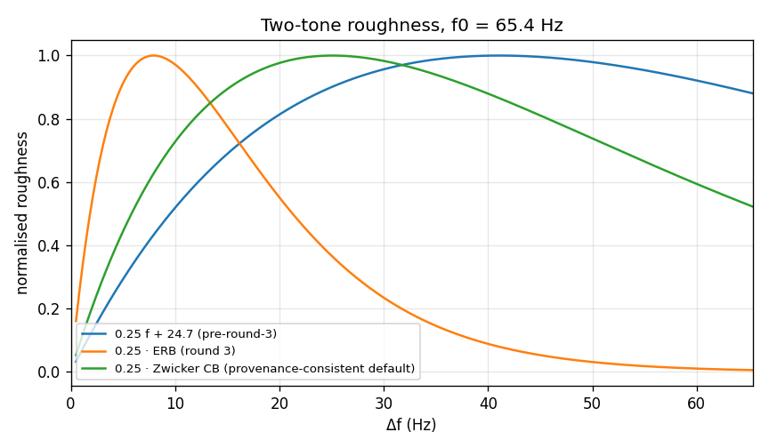
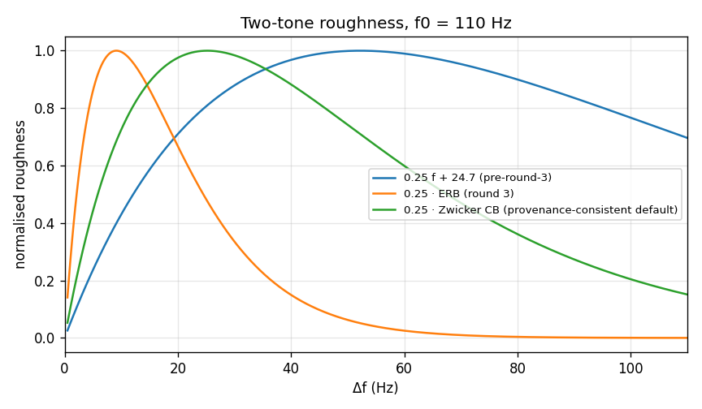
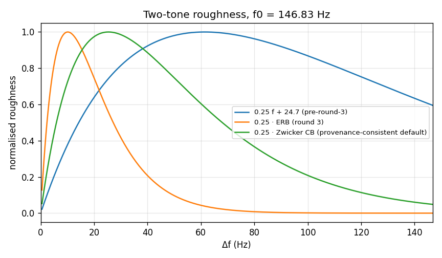
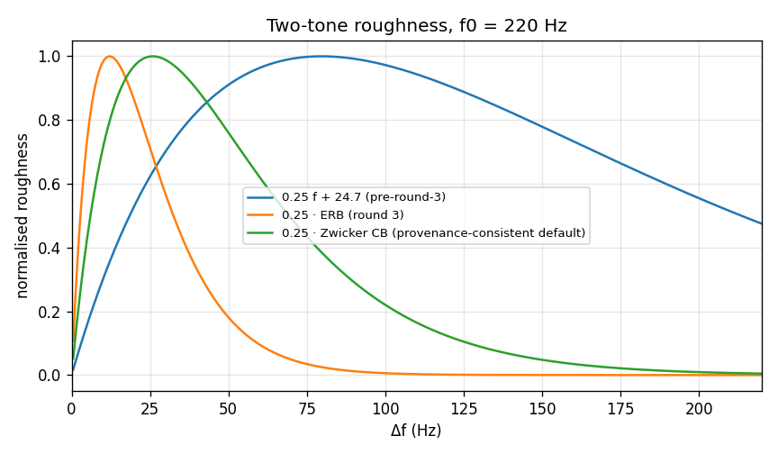
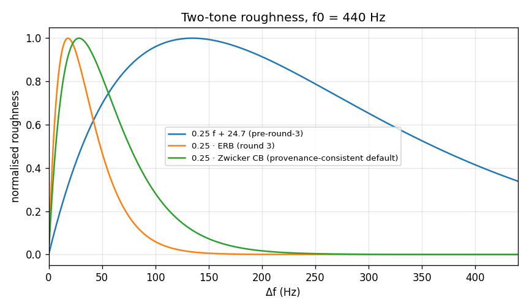
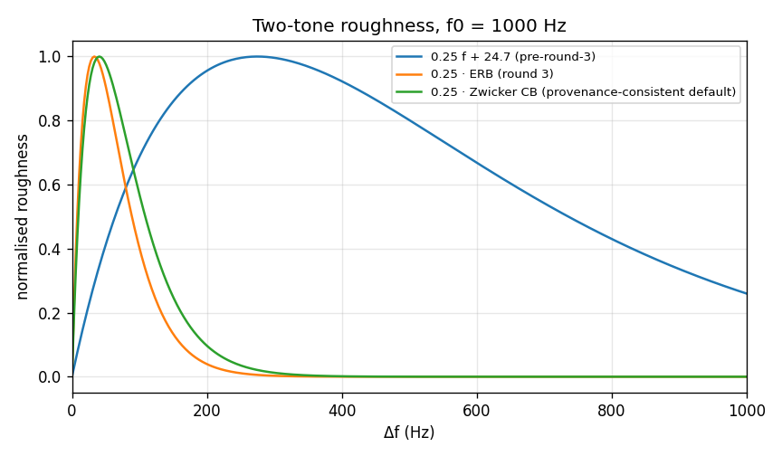

# Roughness bandwidth basis — author validation artefact

The default `bandwidth_basis="zwicker_cb"` is signed off on
**provenance grounds** (see below). Comparison against Plomp &
Levelt (1965) Fig. 10 is outstanding corroboration and is
**non-blocking**.

Kernels:

- `legacy_conflated`: `x = df / (0.25 f + 24.7)` (pre-round-3).
- `erb`: `x = df / (0.25 · ERB(f))`, `ERB(f) = 0.108 f + 24.7` (round 3).
- `zwicker_cb`: `x = df / (0.25 · CB_Z(f))`,
  `CB_Z(f) = 25 + 75 (1 + 1.4 (f/1000)^2)^0.69` (Zwicker & Fastl, 2007).

The ACD ERB helper in `tools/spectral_density_hill.py` is independent
and was not imported here.

## Provenance (the load-bearing argument)

Plomp and Levelt (1965) derived the 25%-of-critical-bandwidth result
against the critical-band data of Zwicker, Flottorp and Stevens (1957).
ERB is a different psychophysical construct, measured by a different
method, and was not published until Glasberg and Moore (1990).
Applying P&L's 0.25 factor to an ERB denominator is therefore a
**unit mismatch with the source**, independent of which formula better
describes the auditory filter. Zwicker & Fastl (2007) is a fit to the
same lineage P&L used, so `zwicker_cb` is the provenance-consistent
basis.

This argument is checkable from the papers. Overlaying the two-tone
curves on P&L Fig. 10 is corroboration, not the basis of the decision.

## Quarter-bandwidth widths

| f (Hz) | 0.25·ERB | 0.25·Zwicker CB | ratio Z/ERB |
|---:|---:|---:|---:|
| 65.4 | 7.94 | 25.08 | 3.16 |
| 110 | 9.14 | 25.22 | 2.76 |
| 146.83 | 10.14 | 25.39 | 2.50 |
| 220 | 12.11 | 25.87 | 2.14 |
| 440 | 18.05 | 28.37 | 1.57 |
| 1000 | 33.17 | 40.55 | 1.22 |

## Maximum-location table

`df` of the two-tone peak (unit amplitudes). The last column is an
**identity check**: it is `0.25 × Zwicker CB(f0)` evaluated by the
same formula as the kernel denominator, not an external Plomp–Levelt
measurement. Residuals against the swept peak are sweep-grid
resolution plus the min-frequency convention (peak search uses
`np.linspace(0.5, max(2·f0, 400), 400)`, so the step is
`(hi − 0.5) / 399` Hz). The table shows the
implementation computing what it was told to compute. It is not
external validation.

| f0 (Hz) | legacy `0.25f+24.7` | 0.25·ERB | 0.25·Zwicker | identity check (grid resolution) | grid step (Hz) |
|---:|---:|---:|---:|---:|---:|
| 65.4 | 41.55 | 7.51 | 25.53 | 25.08 | 1.001 |
| 110 | 52.57 | 9.51 | 25.53 | 25.22 | 1.001 |
| 146.83 | 61.58 | 10.51 | 25.53 | 25.39 | 1.001 |
| 220 | 79.81 | 12.62 | 25.83 | 25.87 | 1.102 |
| 440 | 134.96 | 18.13 | 29.16 | 28.37 | 2.204 |
| 1000 | 276.12 | 35.58 | 40.59 | 40.55 | 5.011 |

## Corpus-register impact (20-partial 1/n series)

Total pairwise roughness with the 15.5 kHz Zwicker ceiling applied
(pairs whose higher member exceeds 15500 Hz
are dropped). Ratios are not a constant scale factor.

| f0 (Hz) | legacy | ERB | Zwicker | ERB/Zwicker | legacy/Zwicker |
|---:|---:|---:|---:|---:|---:|
| 65.4 | 1.81502 | 0.0817166 | 0.603422 | 0.135 | 3.008 |
| 110 | 1.52499 | 0.0544044 | 0.215322 | 0.253 | 7.082 |
| 146.83 | 1.40581 | 0.0475823 | 0.119136 | 0.399 | 11.800 |
| 220 | 1.28148 | 0.0418422 | 0.0783963 | 0.534 | 16.346 |
| 440 | 1.15319 | 0.0368722 | 0.089239 | 0.413 | 12.922 |
| 1000 | 0.948746 | 0.020782 | 0.0899965 | 0.231 | 10.542 |

## Zwicker CB validity ceiling (15.5 kHz)

20-partial 1/n series. `no ceiling` passes `validity_max_hz=None`.
The default kernel uses `CB_ZWICKER_VALID_MAX_HZ = 15500`. The
f0 = 1000 Hz row changes: nearly a third of the uncapped total
came from pairs whose higher member sits above the Bark scale.

| f0 (Hz) | no ceiling | ≤ 15.5 kHz | share above | pairs excluded |
|---:|---:|---:|---:|---:|
| 65.4 | 0.6034 | 0.6034 | 0.0% | 0 |
| 110 | 0.2153 | 0.2153 | 0.0% | 0 |
| 146.83 | 0.1191 | 0.1191 | 0.0% | 0 |
| 220 | 0.0784 | 0.0784 | 0.0% | 0 |
| 440 | 0.0892 | 0.0892 | 0.0% | 0 |
| 1000 | 0.1315 | 0.0900 | 31.5% | 85 |

## Two-tone curves

Each PNG is normalised to its own maximum. Raw (unnormalised) sweeps
are in `docs/validation/data/`. Compact table: roughness at selected
Δf / f0 ratios for f0 = 146.83 Hz (unit amplitudes).

| Δf/f0 | Δf (Hz) | legacy | ERB | Zwicker |
|---:|---:|---:|---:|---:|
| 0.02 | 3.07 | 0.12916 | 0.60764 | 0.29102 |
| 0.05 | 7.47 | 0.29273 | 0.95855 | 0.59582 |
| 0.10 | 14.80 | 0.51491 | 0.92169 | 0.88468 |
| 0.15 | 22.14 | 0.68335 | 0.66866 | 0.99107 |
| 0.17 | 25.07 | 0.7378 | 0.567 | 0.99992 |
| 0.20 | 29.47 | 0.80733 | 0.43184 | 0.98837 |
| 0.25 | 36.81 | 0.89473 | 0.26162 | 0.92463 |
| 0.50 | 73.48 | 0.98303 | 0.01403 | 0.43538 |
| 1.00 | 146.83 | 0.59492 | 2.0231e-05 | 0.048397 |

CSV sweeps:

- `docs/validation/data/roughness_twotone_f0_65hz.csv`
- `docs/validation/data/roughness_twotone_f0_110hz.csv`
- `docs/validation/data/roughness_twotone_f0_147hz.csv`
- `docs/validation/data/roughness_twotone_f0_220hz.csv`
- `docs/validation/data/roughness_twotone_f0_440hz.csv`
- `docs/validation/data/roughness_twotone_f0_1000hz.csv`

Figures:

- `docs/validation/figures/roughness_twotone_f0_65hz.png`

- `docs/validation/figures/roughness_twotone_f0_110hz.png`

- `docs/validation/figures/roughness_twotone_f0_147hz.png`

- `docs/validation/figures/roughness_twotone_f0_220hz.png`

- `docs/validation/figures/roughness_twotone_f0_440hz.png`

- `docs/validation/figures/roughness_twotone_f0_1000hz.png`

## Real corpus notes

No corpus take was mounted (`ACD_REAL_NOTE_AUDIO` unset; default
cello path absent). Task 4 remains gated.

## Outstanding judgement

The bandwidth basis is signed off on provenance grounds.
Overlay on Plomp & Levelt (1965) Fig. 10 remains an outstanding
but **non-blocking** corroboration check.
